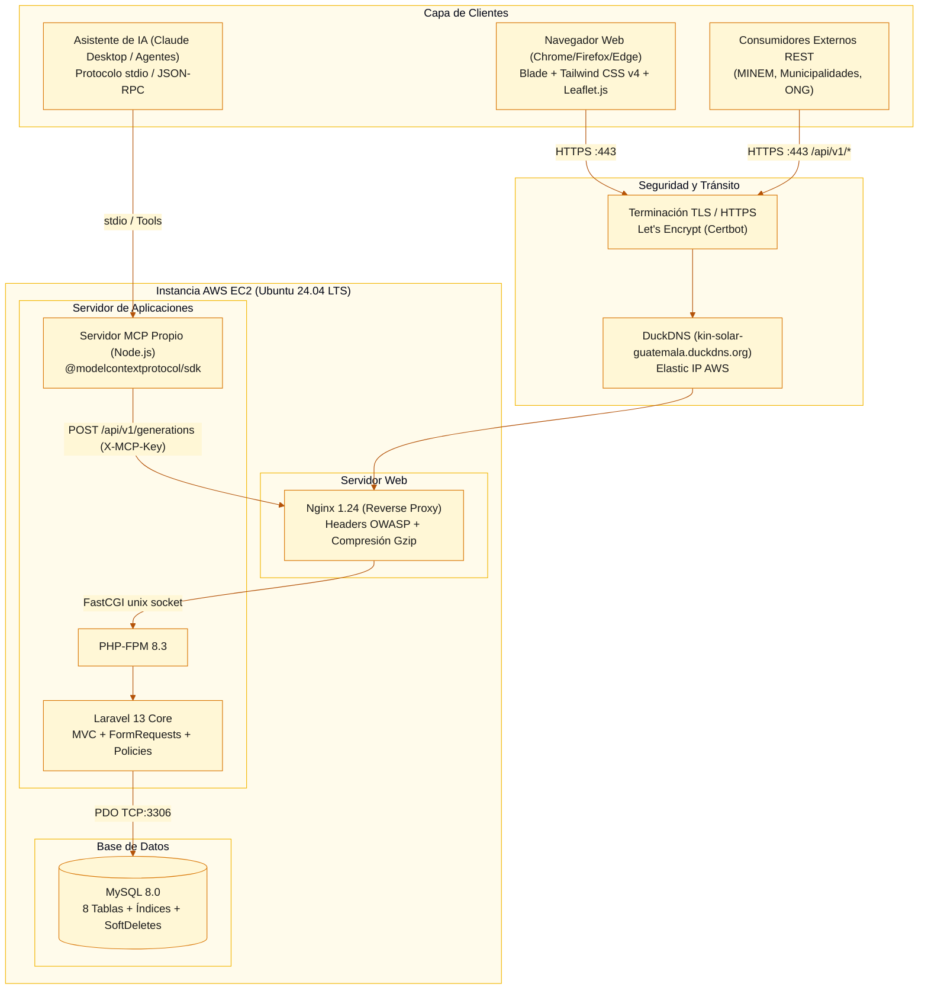

# Especificación de Requerimientos de Software (ERS)

> **Norma de referencia:** IEEE 830-1998 / ISO/IEC/IEEE 29148:2018.
> **Proyecto:** Sistema de Registro y Monitoreo de Generación Solar por Departamento (Guatemala).
> **Contexto:** Competencia de Programación con IA — Día del Programador, Universidad Mariano Gálvez, sede Puerto Barrios.

| Campo | Detalle |
|---|---|
| **Proyecto** | Sistema de Registro y Monitoreo de Generación Solar por Departamento |
| **Versión** | 1.0 (Congelada Hora 1) |
| **Fecha** | 11/09/2026 |
| **Organización** | Universidad Mariano Gálvez de Guatemala — Facultad de Ingeniería en Sistemas, sede Puerto Barrios |
| **Autores** | Andy Fabricio Aquino Escobar (0909-22-1669) · Carlos Giovanni Martínez (0909-22-19157) |
| **Contexto** | Competencia de Programación con IA — Día del Programador 2026 |
| **Estado** | Aprobado y Congelado |

### Control de versiones del documento

| Versión | Fecha | Autor | Descripción del cambio |
|---|---|---|---|
| 1.0 | 11/09/2026 | Andy Aquino & Carlos Martínez | Versión inicial completa basada en el pliego del reto nacional de generación solar |

---

## 1. Introducción

### 1.1 Propósito
El presente documento constituye la Especificación de Requerimientos de Software (ERS) formal para el **Sistema de Registro y Monitoreo de Generación Solar por Departamento de Guatemala**, redactado bajo el estándar IEEE 830-1998 y su evolución ISO/IEC/IEEE 29148:2018. Establece los requerimientos funcionales, no funcionales, reglas de negocio matemáticas y restricciones técnicas que rigen el desarrollo y evaluación del sistema.

Está dirigido al equipo de desarrollo (integrado por Andy Aquino y Carlos con 5 agentes de IA coordinados), a la terna examinadora y a los evaluadores de la competencia.

### 1.2 Alcance
El sistema es una plataforma web desarrollada en **Laravel 11 / PHP 8.3** que centraliza la administración de infraestructura de energía solar en los **22 departamentos de Guatemala**. Permite registrar granjas solares con coordenadas geográficas, vincular paneles y calcular automáticamente la capacidad instalada en kW, registrar mediciones periódicas de generación energética real y estimada en kWh, computar la reducción de dióxido de carbono ($0.40\text{ kg CO}_2/\text{kWh}$), generar alertas automáticas ante desviaciones críticas ($\ge 20\%$), proyectar generación futura con base en regímenes climáticos estacionales de Guatemala, visualizar los activos sobre un mapa interactivo nacional (Leaflet.js) y exponer un conjunto de endpoints API REST documentados.

**Explícitamente fuera del alcance:**
1. Catálogo nominal individualizado de familias beneficiadas (se registra únicamente el conteo total acumulado por granja según las bases).
2. Procesamiento de cobros, facturación eléctrica o integración a la red mayorista del AMM/CNEE.
3. Modelos opacos de Deep Learning que requieran servidores dedicados de GPU (se utiliza un modelo algorítmico estadístico de estacionalidad bimodal guatemalteca explicable y auditable en PHP).

### 1.3 Definiciones, acrónimos y abreviaturas

| Sigla / Término | Definición |
|---|---|
| **ERS** | Especificación de Requerimientos de Software. |
| **RF / RNF** | Requerimiento Funcional / Requerimiento No Funcional. |
| **kW / kWh** | Kilovatio (unidad de potencia instalada) / Kilovatio-hora (unidad de energía generada en un período). |
| **CO₂ Evitado** | Cantidad de emisiones de dióxido de carbono mitigadas mediante energía limpia ($0.40\text{ kg CO}_2/\text{kWh}$). |
| **IDOR** | *Insecure Direct Object Reference* — Vulnerabilidad crítica mitigada según OWASP A01. |
| **RBAC** | *Role-Based Access Control* — Control de acceso basado en roles (`admin`, `operador`, `visualizador`). |

---

## 2. Descripción General del Sistema

### 2.1 Perspectiva del Producto
El software es un sistema web autónomo desplegado en la nube pública bajo arquitectura cliente-servidor de 3 capas:
1. **Capa de Presentación:** Blade templating con Tailwind CSS v4, interactividad reactiva con Alpine.js/Vanilla y mapas con Leaflet.js.
2. **Capa de Negocio (Laravel Services):** Servicios desacoplados de cálculo ambiental (`CarbonOffsetService`), alertas automáticas (`AlertEvaluationService`) y proyección estacional (`SolarForecastService`).
3. **Capa de Persistencia (MySQL 8):** Modelo relacional normalizado con integridad referencial, índices espaciales/temporales y tabla de auditoría.

**Diagrama de Arquitectura y Despliegue Físico:**

### 2.2 Características de los Usuarios

| Rol | Responsabilidades | Nivel Técnico | Módulos con Acceso |
|---|---|---|---|
| **Administrador** | Gestión de infraestructura, departamentos, usuarios, parámetros ambientales y auditoría. | Alto | 100 % del sistema |
| **Operador** | Registro de granjas, asignación de paneles, carga periódica de generación y seguimiento de alertas. | Medio | Granjas, paneles, mediciones y alertas |
| **Visualizador** | Consulta de tableros, mapa interactivo, reportes ejecutivos, proyecciones y API pública. | Básico | Dashboard, mapa, reportes, API |

### 2.3 Roles del Equipo y Distribución de Responsabilidades

| Integrante | Rol en el Proyecto | Tareas Principales Realizadas | Agentes de IA Operados |
|---|---|---|---|
| **Andy Fabricio Aquino Escobar** | Co-Arquitecto e Integrador (Agente E) · Frontend / UI-UX (Agente C) | Diseño del esquema de base de datos, autorización y Policies (junto con el Agente A); maquetación de vistas Blade; diseño del sistema visual con Tailwind CSS v4; integración del mapa interactivo con Leaflet.js; resolución de conflictos y merge de Pull Requests; documentación técnica y corrección de detalles del ERS. | Claude Code (Agente E) · Antigravity (Agente C) |
| **Carlos Giovanni Martínez** | Arquitecto Principal e Integrador (Agente A) · Backend y DevOps (Agentes B y D) | Migraciones, modelos Eloquent y Policies de autorización; controladores y FormRequests; lógica de servicios desacoplados (`CarbonOffsetService`, `AlertEvaluationService`, `ForecastService`); implementación de telemetría; pipeline de despliegue en AWS EC2; auditoría de seguridad OWASP Top 10:2025 y servidor MCP propio. | Claude Code (Agente A) · Codex (Agente B) · Antigravity (Agente D) |

---

## 3. Requerimientos Funcionales Específicos

#### RF-01 — Catálogo Oficial de los 22 Departamentos de Guatemala
- **Descripción:** El sistema debe precargar mediante seeders los 22 departamentos de la República de Guatemala con sus coordenadas de referencia (latitud y longitud). Cada granja solar debe asociarse estrictamente a uno de estos 22 departamentos.
- **Criterio de Aceptación:** Los 22 departamentos están disponibles en selectores y filtros; no es posible crear una granja sin departamento válido.

#### RF-02 — Registro y Gestión de Paneles Solares
- **Descripción:** Permite administrar el catálogo de modelos de panel solar: marca, modelo, potencia nominal en kW ($>0$) y estado operativo (activo/inactivo/mantenimiento).
- **Criterio de Aceptación:** Validación de potencia nominal positiva; edición y desactivación sin afectar mediciones históricas ya registradas.

#### RF-03 — Registro y Administración de Granjas Solares
- **Descripción:** CRUD completo (crear, consultar, editar y desactivar mediante SoftDeletes) de granjas solares.
- **Criterio de Aceptación:** La desactivación lógica de una granja conserva su historial de generación pero la oculta del estado activo operativo.

#### RF-04 — Ubicación Geográfica de Granjas
- **Descripción:** Almacenamiento de latitud y longitud decimales con precisión de hasta 7 decimales para posicionamiento exacto sobre el mapa de Guatemala.
- **Criterio de Aceptación:** Validación de coordenadas dentro de los límites geográficos de Guatemala ($\text{Lat: } 13.7^\circ \text{ a } 17.9^\circ \text{ N}$, $\text{Long: } -92.3^\circ \text{ a } -88.2^\circ \text{ W}$).

#### RF-05 — Asociación de Paneles por Granja
- **Descripción:** Relación de muchos a muchos entre granjas y modelos de panel, indicando la cantidad de unidades instaladas de cada modelo.
- **Criterio de Aceptación:** Se puede agregar o ajustar cantidades de paneles por modelo para una granja específica.

#### RF-06 — Cálculo Automático de Capacidad Instalada Total
- **Descripción:** El sistema debe computar automáticamente la capacidad instalada total en kW de cada granja sumando el producto de cada modelo por su cantidad:
  $$\text{Capacidad Total (kW)} = \sum (\text{cantidad}_i \times \text{potencia nominal en kW}_i)$$
- **Criterio de Aceptación:** La capacidad se recalcula en tiempo real cuando se modifican los paneles asociados y se muestra en fichas y tablas.

#### RF-07 — Registro de Familias Beneficiadas
- **Descripción:** Cada granja debe registrar el número entero de familias beneficiadas por su producción energética.
- **Criterio de Aceptación:** Campo numérico entero no negativo ($\ge 0$); no se exige desglose nominal de las familias.

#### RF-08 — Registro de Generación Energética Real
- **Descripción:** Permite ingresar la generación energética real en kilovatios-hora (kWh) para un período mensual (formato YYYY-MM) o fecha determinada.
- **Criterio de Aceptación:** No se permiten duplicados del mismo período para una misma granja; valor en kWh debe ser numérico mayor o igual a cero.

#### RF-09 — Generación Estimada / Esperada por Período
- **Descripción:** Cada registro de generación debe manejar la generación esperada en kWh calculada o ingresada para comparar el desempeño real vs. estimado.
- **Criterio de Aceptación:** Permite evaluar la desviación porcentual entre lo esperado y lo real.

#### RF-10 — Cálculo Automático de CO₂ Evitado
- **Descripción:** El sistema debe aplicar de forma automática e invariable el factor oficial:
  $$\mathbf{0.40\text{ kg de CO}_2 \text{ por cada kWh generado}}$$
  El resultado debe presentarse tanto en kilogramos (kg) como en toneladas métricas ($\text{ton} = \text{kg} / 1000$).
- **Criterio de Aceptación:** Para 10,000 kWh reales generados, el sistema muestra exactamente $4,000.00\text{ kg}$ y $4.00\text{ toneladas}$ de CO₂ evitado.

#### RF-11 — Dashboard Ejecutivo e Indicadores Nacionales
- **Descripción:** Panel de control central con 6 métricas clave nacionales: total granjas, total paneles, capacidad instalada total (kW), generación acumulada (kWh), total familias beneficiadas y total de CO₂ evitado (kg/ton). Además incluye ranking departamental y comparativa visual real vs. esperada.
- **Criterio de Aceptación:** Los números se actualizan dinámicamente con los datos de la base de datos; diseño responsivo y sin errores visuales.

#### RF-12 — Reportes Comparativos Departamentales
- **Descripción:** Reporte tabular y consolidado que muestra por departamento: número de granjas, paneles totales, capacidad instalada (kW), generación real acumulada (kWh), familias beneficiadas y CO₂ evitado.
- **Criterio de Aceptación:** Los 22 departamentos aparecen totalizados con opción de exportación a formato imprimible/CSV.

#### RF-13 — Mapa Interactivo Obligatorio de Guatemala
- **Descripción:** Mapa interactivo centrado en Guatemala (Leaflet.js + OpenStreetMap) con marcadores para cada granja solar. Al hacer clic sobre un marcador se despliega un popup con: nombre, departamento, capacidad instalada en kW, generación reciente y familias beneficiadas.
- **Criterio de Aceptación:** Navegación, zoom fluido y filtrado por departamento funcional directamente en el mapa.

#### RF-14 — Detección Automática de Anomalías y Alertas
- **Descripción:** Si en un período determinado la generación real es un **20% o más inferior** a la esperada ($\text{real} \le 0.80 \times \text{esperada}$), el sistema genera automáticamente una alerta activa con: granja, período, esperada, real y porcentaje exacto de déficit.
- **Criterio de Aceptación:** Si esperada = 100 kWh y real = 79 kWh (déficit 21%), se genera alerta activa visible en la bandeja y en el dashboard; si real = 85 kWh (déficit 15%), no se genera alerta.

#### RF-15 — Proyección de Generación Futura Justificada
- **Descripción:** Algoritmo que proyecta la generación en kWh para períodos futuros con base en histórico y factores climatológicos estacionales de Guatemala (estación seca vs. lluviosa).
- **Criterio de Aceptación:** Se muestra el valor proyectado, la explicación metodológica del algoritmo y la comparación ex-post de error cuando existan datos reales.

#### RF-16 — API REST Funcional y Documentada
- **Descripción:** API bajo el prefijo `/api/v1` que entrega respuestas JSON normalizadas para `/departments`, `/farms`, `/generations` y `/statistics`.
- **Criterio de Aceptación:** Respuestas rápidas con código HTTP 200 y documentación legible accesible desde la aplicación web en `/api-docs`.

#### RF-17 — Validación de Datos y Seguridad en Servidor
- **Descripción:** Todos los formularios validan tipos de datos, obligatoriedad, rangos y claves foráneas mediante `FormRequest`s de Laravel, rechazando datos anómalos antes de tocar la base de datos.
- **Criterio de Aceptación:** Ningún formulario permite inyección ni datos inconsistentes; errores se muestran claramente junto al campo correspondiente.

---

## 4. Requerimientos No Funcionales (RNF)

| ID | Categoría | Métrica Verificable |
|---|---|---|
| **RNF-01** | Rendimiento | Tiempo de respuesta de vistas principales $\le 2.0\text{ s}$; consultas con Eloquent optimizadas sin problema N+1. |
| **RNF-02** | Seguridad OWASP 2025 | Cumplimiento del checklist: denegar por defecto, políticas RBAC, escape automático de variables en Blade `{{ }}`, protección CSRF activa, sin secretos en repositorio. |
| **RNF-03** | Disponibilidad | Aplicación operativa y accesible mediante URL pública HTTPS durante toda la competencia. |
| **RNF-04** | Usabilidad / UI | Interfaz coherente bajo sistema de diseño solar con paleta de colores unificada y navegación en $\le 3$ clics. |
| **RNF-05** | Responsividad | Adaptabilidad probada en pantallas de 360 px (móvil), 768 px (tablet) y 1440 px (desktop). |
| **RNF-06** | Auditabilidad | Registro inmutable de eventos sensibles en la tabla `audit_logs` con IP, user agent, fecha y usuario. |

---

## 5. Matriz de Trazabilidad y Asignación

| ID | Requerimiento | Módulo | Agente Dueño | PR Previsto |
|---|---|---|---|---|
| **RF-01** | Departamentos de Guatemala | Infraestructura | Agente A/E (Claude) | PR #1 (Scaffolding & Migraciones) |
| **RF-02** | Catálogo de Paneles Solares | Activos | Agente B (Codex) | PR #2 (CRUD Paneles) |
| **RF-03** | CRUD Granjas Solares | Activos | Agente B (Codex) | PR #3 (CRUD Granjas) |
| **RF-04** | Geolocalización Lat/Long | Activos / Mapa | Agente B & C | PR #3 & PR #4 |
| **RF-05** | Paneles por Granja | Activos | Agente B (Codex) | PR #3 |
| **RF-06** | Cálculo Capacidad en kW | Lógica de Negocio | Agente B (Codex) | PR #3 |
| **RF-07** | Familias Beneficiadas | Activos | Agente B (Codex) | PR #3 |
| **RF-08** | Generación Energética Real | Mediciones | Agente B (Codex) | PR #5 (Generación & CO₂) |
| **RF-09** | Generación Estimada | Mediciones | Agente B (Codex) | PR #5 |
| **RF-10** | Cálculo de CO₂ ($0.40\text{ kg/kWh}$) | Ambiental | Agente B (Codex) | PR #5 |
| **RF-11** | Dashboard e Indicadores | Analítica | Agente C & B | PR #6 (Dashboard & UI) |
| **RF-12** | Reportes por Departamento | Reportes | Agente B & C | PR #7 (Reportes) |
| **RF-13** | Mapa Interactivo Leaflet | Visualización | Agente C (Antigravity) | PR #4 (Mapa Interactivo) |
| **RF-14** | Alertas Automáticas ($\ge 20\%$) | Monitoreo | Agente B (Codex) | PR #8 (Alertas) |
| **RF-15** | Proyecciones Estacionales | Proyecciones | Agente B & E | PR #9 (Proyecciones) |
| **RF-16** | API REST v1 Documentada | Integración | Agente B & C | PR #10 (API REST) |
| **RF-17** | FormRequests y Seguridad | Seguridad | Agentes A, B y D | Continuo en todos los PRs |

---

## 6. Firma de Aprobación
Documento aprobado a las 18:00 del viernes 11 de septiembre de 2026.
**Equipo:** Andy Fabricio Aquino Escobar (Carné 0909-22-1669) · Carlos Giovanni Martínez (Carné 0909-22-19157)
