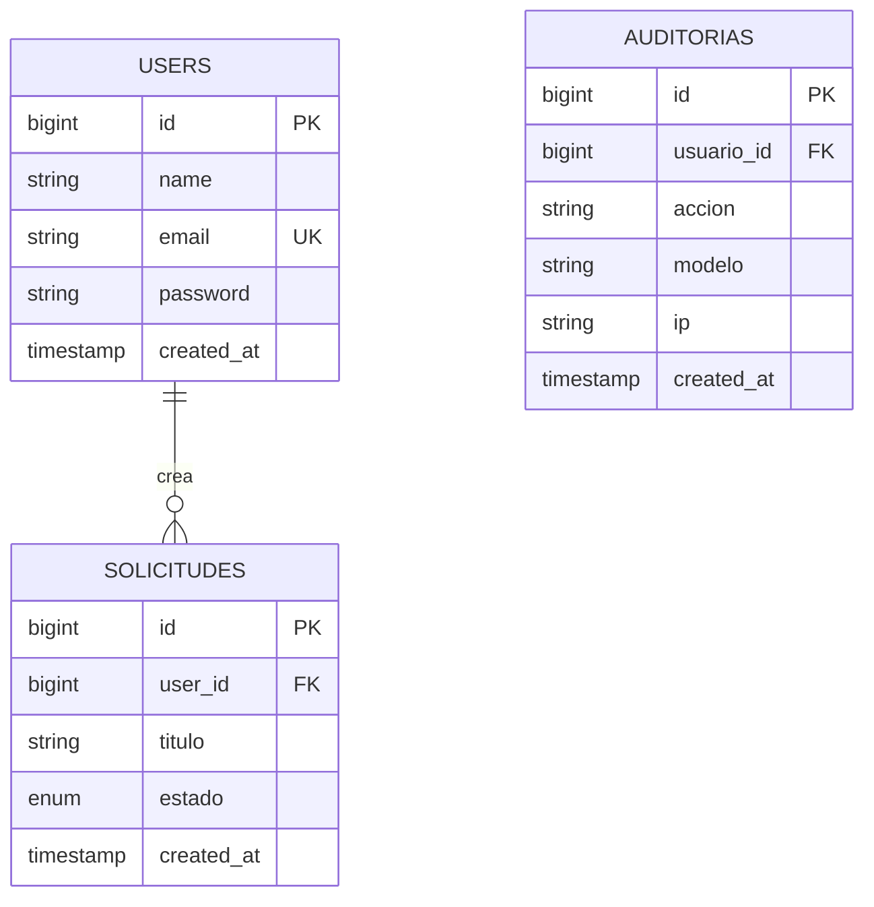

# Especificación de Requerimientos de Software (ERS)

> **Plantilla express** basada en IEEE 830-1998 / ISO/IEC/IEEE 29148:2018.
> Derivada del ERS del proyecto SmartWISP Digital Twin Platform, reducida al alcance
> alcanzable en una competencia de 12 horas.
>
> **Se llena en la Hora 1 (17:00–18:00 del viernes), antes de escribir una sola línea de código.**
> Instrucción para el agente que la llene: reemplazar todo lo que esté entre `<...>`
> y eliminar los bloques marcados como *Instrucción*.

| Campo | Detalle |
|---|---|
| Proyecto | `<Nombre del sistema>` |
| Versión | 1.0 |
| Fecha | 11/09/2026 |
| Organización | Universidad Mariano Gálvez de Guatemala — Facultad de Ingeniería en Sistemas, sede Puerto Barrios |
| Autores | Andy Fabricio Aquino Escobar (0909-22-1669) · `<Carlos, carné>` |
| Contexto | Competencia de Programación con IA — Día del Programador |
| Estado | Borrador / Aprobado |

### Control de versiones del documento

| Versión | Fecha | Autor | Descripción del cambio |
|---|---|---|---|
| 1.0 | 11/09/2026 | | Versión inicial elaborada a partir del planteamiento del problema |

---

## 1. Introducción

### 1.1 Propósito

El presente documento constituye la Especificación de Requerimientos de Software del sistema
`<Nombre>`, elaborado conforme al estándar IEEE 830-1998 y su actualización ISO/IEC/IEEE 29148:2018.
Su propósito es definir de manera formal, precisa y verificable los requerimientos funcionales,
no funcionales e interfaces del sistema, estableciendo el contrato técnico del equipo de desarrollo.

El documento está dirigido a: (a) el equipo de desarrollo; (b) la terna evaluadora de la
competencia; y (c) cualquier evaluador técnico que requiera comprender el alcance del sistema.

### 1.2 Alcance

`<Qué hace el sistema, en dos párrafos. Objetivo general + objetivos específicos (a), (b), (c)...>`

**Queda explícitamente fuera del alcance:** `<listar 3 o 4 exclusiones. Esto protege del scope creep
y demuestra criterio de ingeniería ante el jurado.>`

### 1.3 Definiciones, acrónimos y abreviaturas

| Término / Sigla | Definición |
|---|---|
| ERS | Especificación de Requerimientos de Software |
| RF | Requerimiento Funcional |
| RNF | Requerimiento No Funcional |
| CU | Caso de Uso |
| RBAC | Role-Based Access Control — modelo de seguridad donde los permisos se asignan a roles |
| OWASP | Open Web Application Security Project |
| CSRF | Cross-Site Request Forgery |
| IDOR | Insecure Direct Object Reference |
| | |

### 1.4 Referencias

- IEEE. (1998). *IEEE recommended practice for software requirements specifications* (IEEE Std 830-1998).
- IEEE. (2018). *ISO/IEC/IEEE 29148:2018 — Systems and software engineering — Requirements engineering*.
- OWASP Foundation. (2025). *OWASP Top 10:2025*. https://owasp.org/Top10/2025/
- Object Management Group. (2017). *OMG Unified Modeling Language Specification* (v2.5.1).
- Laravel LLC. (2026). *Laravel documentation*. https://laravel.com/docs
- `<Documento del reto entregado por la organización de la competencia>`

---

## 2. Descripción general del sistema

### 2.1 Perspectiva del producto

`<Sistema nuevo desarrollado desde cero. Arquitectura cliente-servidor de tres capas:
(a) capa de presentación ...; (b) capa de lógica de negocio ...; (c) capa de datos ...>`

### 2.2 Funciones del producto

| Módulo | Descripción | Requerimientos |
|---|---|---|
| Módulo I — Gestión de Acceso y Seguridad | Autenticación, RBAC y auditoría | RF-01, RF-02 |
| Módulo II — `<...>` | | |
| Módulo III — `<...>` | | |

### 2.3 Características de los usuarios

| Tipo de usuario | Responsabilidades | Nivel técnico | Módulos con acceso |
|---|---|---|---|
| Administrador | | Alto | Todos |
| `<Rol 2>` | | Medio | |
| `<Rol 3>` | | Básico | |

### 2.4 Restricciones generales

- **Tecnología:** PHP 8.3, Laravel, MySQL 8, Blade + Tailwind CSS v4, Vite.
- **Seguridad:** todas las comunicaciones sobre HTTPS/TLS 1.2+. Contraseñas con hash bcrypt.
  Cumplimiento del OWASP Top 10:2025 según `docs/02-SEGURIDAD-OWASP-2025.md`.
- **Compatibilidad:** Chrome 100+, Firefox 100+, Edge 100+, Safari 15+. Diseño responsivo desde 360 px.
- **Tiempo:** el sistema debe estar desplegado y accesible públicamente al momento de la evaluación.

### 2.5 Suposiciones y dependencias

| Servicio / Supuesto | Propósito | Impacto si no está disponible |
|---|---|---|
| `<Hosting>` | Despliegue público del sistema | El sistema no es evaluable |
| | | |

---

## 3. Requerimientos específicos

### 3.1 Interfaces externas

**Interfaces de usuario:** `<describir las pantallas principales, la navegación y el comportamiento
de los formularios>`

**Interfaces de software:** `<APIs o servicios externos, si aplica>`

### 3.2 Requerimientos funcionales

> *Instrucción:* un bloque por requerimiento. Priorizar: marcar cuáles son
> **principales** (deben funcionar sin falta) y cuáles **secundarias**.
> La rúbrica exige que ambas funcionen para el puntaje máximo — por eso la lista debe ser corta y realista.

#### RF-01 — Autenticación y gestión de sesiones por roles

| Campo | Detalle |
|---|---|
| **Descripción** | El sistema debe permitir el inicio y cierre de sesión seguro para todos los usuarios registrados, diferenciando el acceso a módulos según el rol asignado. Debe impedir el acceso a módulos no autorizados y registrar en auditoría cada inicio y cierre de sesión. |
| **Actores** | Todos los usuarios registrados |
| **Entradas** | Correo electrónico (formato válido); contraseña (mínimo 8 caracteres, con letras y números) |
| **Proceso** | Validar credenciales → verificar rol → regenerar sesión → registrar en auditoría → redirigir al panel del rol |
| **Salidas** | Sesión activa; registro en bitácora de auditoría; redirección al dashboard |
| **Criterios de aceptación** | • Credenciales inválidas devuelven mensaje genérico sin indicar qué campo falló. • Tras 5 intentos fallidos en un minuto, el sistema bloquea temporalmente (throttling). • Un usuario con rol bajo que solicite una URL de administrador recibe **HTTP 403**. • El evento queda en la tabla de auditoría con usuario, IP, acción y timestamp. |
| **Prioridad** | Alta |
| **Controles OWASP** | A01, A07, A09 |

#### RF-02 — `<Título>`

| Campo | Detalle |
|---|---|
| **Descripción** | |
| **Actores** | |
| **Entradas** | |
| **Proceso** | |
| **Salidas** | |
| **Criterios de aceptación** | |
| **Prioridad** | |
| **Controles OWASP** | |

`<Repetir. Meta realista: entre 8 y 14 RF. Más que eso no da tiempo y arriesga el 25% de funcionalidad.>`

### 3.3 Requerimientos no funcionales

| ID | Categoría | Criterios de aceptación verificables | Prioridad |
|---|---|---|---|
| **RNF-01** | Rendimiento | Carga de pantallas principales ≤ 3 s. Operaciones CRUD ≤ 2 s. | Alta |
| **RNF-02** | Seguridad | Cumplimiento íntegro del checklist OWASP Top 10:2025 documentado en `docs/02-SEGURIDAD-OWASP-2025.md`. Contraseñas con bcrypt. HTTPS/TLS 1.2+. Autorización verificada del lado del servidor en el 100 % de las rutas privadas. | Alta |
| **RNF-03** | Disponibilidad | El sistema permanece accesible en su URL pública durante toda la evaluación. | Alta |
| **RNF-04** | Usabilidad | Un usuario sin capacitación completa la tarea principal en ≤ 3 clics desde el dashboard. Navegación consistente entre pantallas. | Alta |
| **RNF-05** | Compatibilidad | Funciona en los 4 navegadores indicados y es utilizable en pantalla de 360 px de ancho. | Media |
| **RNF-06** | Auditabilidad | Todo evento crítico queda registrado con usuario, acción, IP y timestamp, consultable desde la interfaz. | Alta |
| **RNF-07** | Mantenibilidad | Código conforme a PSR-12. Nomenclatura consistente. Commits atómicos con Conventional Commits. | Media |
| **RNF-08** | Integridad de datos | Restricciones de clave foránea en la base de datos. Operaciones de varios pasos dentro de transacciones. | Alta |

---

## 4. Restricciones de diseño y cumplimiento

### 4.1 Estándares aplicables

| Norma / Estándar | Alcance en el proyecto |
|---|---|
| IEEE 830-1998 | Estructura y redacción del presente documento |
| ISO/IEC/IEEE 29148:2018 | Completitud, verificabilidad y trazabilidad de los requerimientos |
| **OWASP Top 10:2025** | El sistema mitiga los diez riesgos de la edición 2025, incluyendo las categorías nuevas de cadena de suministro de software y manejo de condiciones excepcionales. Detalle en `docs/02-SEGURIDAD-OWASP-2025.md` |
| UML 2.5 | Diagramas de casos de uso, clases y secuencia |
| ISO/IEC 25010:2011 | Marco de atributos de calidad aplicado en los RNF |
| PSR-12 | Estilo de código PHP |
| Conventional Commits 1.0 | Convención de mensajes de commit |

### 4.2 Restricciones tecnológicas

| Capa | Tecnología | Justificación |
|---|---|---|
| Backend | PHP 8.3 + Laravel | Framework maduro; Eloquent, Policies, validación y protección CSRF/XSS de fábrica |
| Base de datos | MySQL 8 | Integridad referencial, transacciones |
| Frontend | Blade + Tailwind CSS v4 + Vite | Consistencia visual rápida y build reproducible |
| Autorización | spatie/laravel-permission | RBAC probado, evita implementar seguridad a mano |
| Reportes | barryvdh/laravel-dompdf | Exportación en PDF |
| Control de versiones | Git + GitHub, flujo de PR sobre `main` | Evidencia auditable de trabajo colaborativo |

---

## 5. Apéndices

### 5.1 Matriz de trazabilidad

| ID | Requerimiento | Caso de uso | Módulo | Prioridad | Criterio principal de aceptación | Agente responsable | PR |
|---|---|---|---|---|---|---|---|
| RF-01 | Autenticación y RBAC | CU-01 | I | Alta | Acceso no autorizado devuelve 403 | A — Claude | #  |
| | | | | | | | |

### 5.2 Casos de uso principales

#### CU-01 — `<Título>`

| Campo | Detalle |
|---|---|
| Módulo | |
| Requerimientos relacionados | RF-XX |
| Descripción | |
| Actor primario | |
| Precondiciones | |
| Flujo principal | 1. … 2. … 3. … |
| Flujos alternativos | |
| Postcondiciones (éxito) | |
| Postcondiciones (fracaso) | |

### 5.3 Modelo de datos

`<Diagrama entidad-relación. Generarlo con Mermaid para que quede versionado en el repositorio
y se pueda regenerar. Ejemplo:>`

### 5.4 Manual de usuario resumido

| Rol | Cómo ingresar | Tareas que puede realizar | Ruta de la pantalla |
|---|---|---|---|
| Administrador | `<URL>` con `<correo>` | | |
| | | | |

### 5.5 Tareas realizadas por integrante y rol

> *Requerido explícitamente por la rúbrica.* Se llena al final a partir de los PR mergeados.

| Integrante | Rol en el equipo | Agentes de IA utilizados | Tareas realizadas | PRs |
|---|---|---|---|---|
| Andy Aquino | Arquitecto e integrador; frontend/UI | Claude Code, Antigravity (Gemini) | | # |
| Carlos | Backend y lógica de negocio; documentación y despliegue | Codex, Antigravity (Gemini) | | # |

### 5.6 Lista de verificación del ERS

- [ ] Todos los RF tienen criterio de aceptación **verificable** (medible, no subjetivo)
- [ ] Todos los RF están trazados en la matriz de trazabilidad
- [ ] Cada RF tiene agente responsable asignado
- [ ] Los RNF tienen métricas concretas, no adjetivos
- [ ] El diagrama ER refleja las migraciones reales del código
- [ ] El alcance excluido está escrito explícitamente
- [ ] El documento no contradice lo que la aplicación hace realmente
