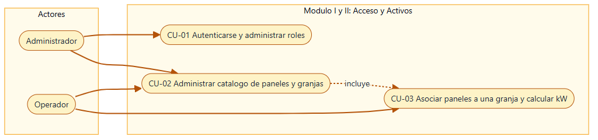
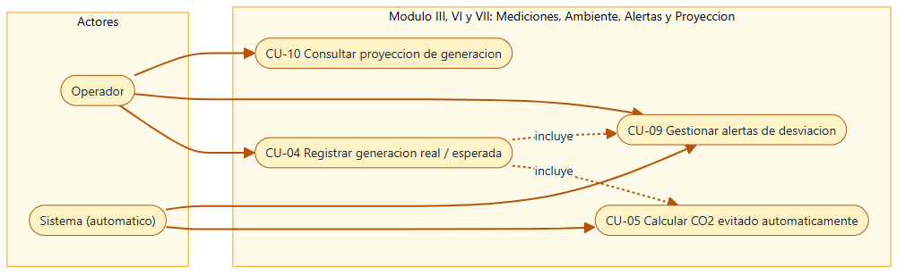
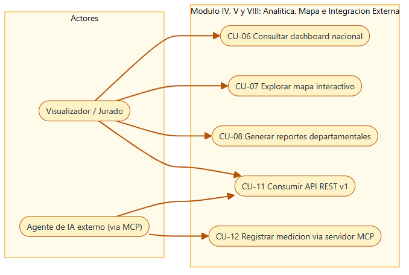
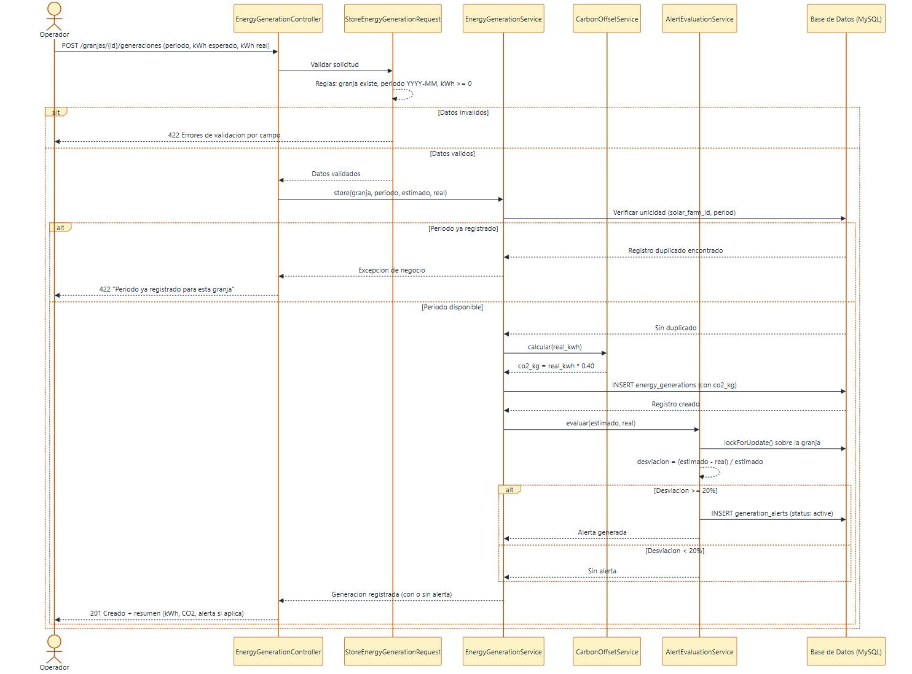
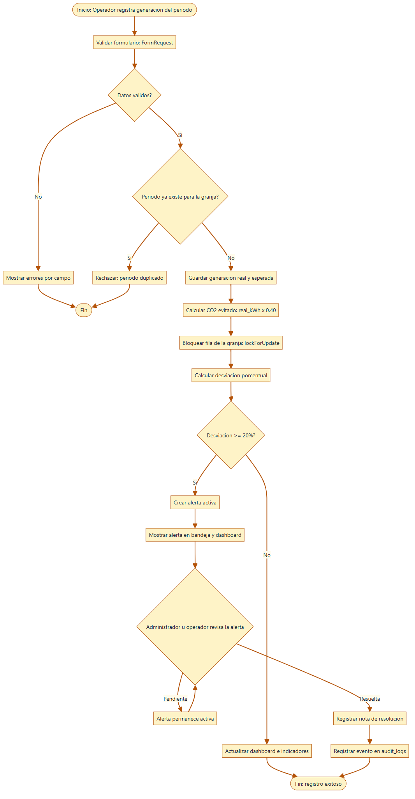
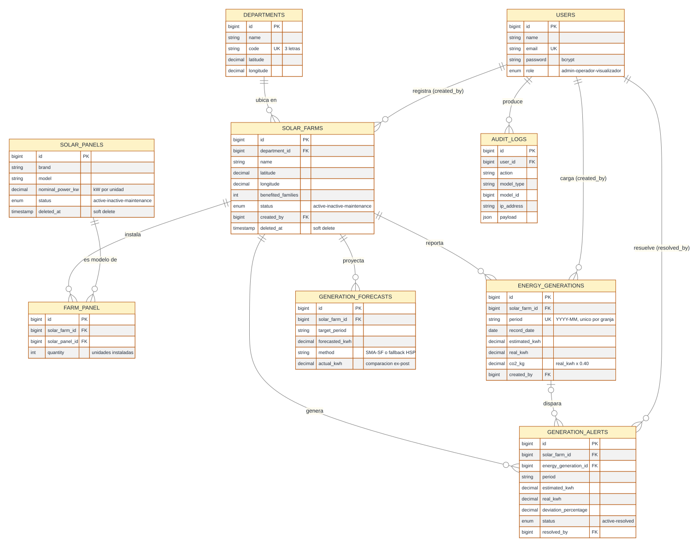

# Especificación de Requerimientos de Software

## (ERS)

**Basada en el estándar IEEE 830-1998 / ISO/IEC/IEEE 29148:2018 — Atributos de calidad conforme a ISO/IEC 25010:2011**

## K'in Solar Guatemala — Sistema de Registro y Monitoreo de Generación Solar por Departamento

| Campo | Detalle | Campo | Detalle |
|---|---|---|---|
| **Proyecto** | K'in Solar Guatemala | **Versión** | 2.0 |
| **Organización** | Universidad Mariano Gálvez de Guatemala — Facultad de Ingeniería en Sistemas, sede Puerto Barrios | **Fecha** | 12/09/2026 |
| **Autores** | Andy Fabricio Aquino Escobar (Carné 0909-22-1669) · Carlos | **Estado** | Aprobado — Post-desarrollo |
| **Contexto** | Competencia de Programación con IA — Día del Programador 2026 | **Revisado por** | Equipo de desarrollo (autorevisión cruzada) |

### Control de versiones del documento

| Versión | Fecha | Autor | Descripción del cambio |
|---|---|---|---|
| 1.0 | 11/09/2026 | Andy Aquino & Carlos | Versión inicial, congelada en la Hora 1, basada en el pliego del reto nacional de generación solar. |
| 2.0 | 12/09/2026 | Andy Aquino & Carlos (con asistencia de IA — ver `04-BITACORA-PROMPTS.md`) | Documento post-desarrollo: carátula con identidad visual del sistema, sección de Objetivos dedicada, interfaces externas, requerimientos ampliados con actor/entrada/proceso/salida/prioridad, 12 RNF, sección de Atributos de Calidad (ISO/IEC 25010), matriz de trazabilidad con casos de uso, doce casos de uso con narrativa completa (flujo normal, alternos y postcondiciones) agrupados en tres diagramas UML, diagrama entidad-relación, diagrama de secuencia y diagrama de actividades, checklist final del documento. |

---

## Índice

1. [Introducción](#1-introducción)
    - [1.1 Propósito](#11-propósito)
    - [1.2 Objetivos](#12-objetivos)
    - [1.3 Alcance](#13-alcance)
    - [1.4 Definiciones, Acrónimos y Abreviaturas](#14-definiciones-acrónimos-y-abreviaturas)
    - [1.5 Referencias](#15-referencias)
    - [1.6 Resumen del Documento](#16-resumen-del-documento)
2. [Descripción General del Sistema](#2-descripción-general-del-sistema)
    - [2.1 Perspectiva del Producto](#21-perspectiva-del-producto)
    - [2.2 Funciones del Producto](#22-funciones-del-producto)
    - [2.3 Características de los Usuarios](#23-características-de-los-usuarios)
    - [2.4 Restricciones Generales](#24-restricciones-generales)
    - [2.5 Suposiciones y Dependencias](#25-suposiciones-y-dependencias)
3. [Requerimientos Específicos](#3-requerimientos-específicos)
    - [3.1 Interfaces Externas](#31-interfaces-externas)
    - [3.2 Requerimientos Funcionales (RF-01 a RF-19)](#32-requerimientos-funcionales)
    - [3.3 Requerimientos No Funcionales (RNF-01 a RNF-12)](#33-requerimientos-no-funcionales-rnf)
4. [Restricciones de Diseño y Cumplimiento](#4-restricciones-de-diseño-y-cumplimiento)
5. [Atributos de Calidad (ISO/IEC 25010)](#5-atributos-de-calidad-isoiec-250102011)
6. [Apéndices](#6-apéndices)
    - [6.1 Matriz de Trazabilidad de Requerimientos](#61-matriz-de-trazabilidad-de-requerimientos)
    - [6.2 Casos de Uso Principales](#62-casos-de-uso-principales)
    - [6.3 Diagramas de Comportamiento Adicionales (Secuencia y Actividades)](#63-diagramas-de-comportamiento-adicionales)
    - [6.4 Modelo de Datos](#64-modelo-de-datos)
    - [6.5 Lista de Verificación (Checklist ERS)](#65-lista-de-verificación-checklist-ers)
7. [Firma de Aprobación](#7-firma-de-aprobación)

---

## 1. Introducción

### 1.1 Propósito

El presente documento constituye la Especificación de Requerimientos de Software (ERS) formal para **K'in Solar Guatemala**, redactado bajo el estándar IEEE 830-1998 y su evolución ISO/IEC/IEEE 29148:2018, incorporando además el modelo de atributos de calidad ISO/IEC 25010:2011 (SQuaRE) como criterio de evaluación no funcional. Su propósito es definir, de manera formal, precisa y verificable, la totalidad de los requerimientos funcionales, no funcionales, reglas de negocio matemáticas, interfaces externas y restricciones técnicas que rigen el desarrollo y la evaluación del sistema, estableciendo un contrato técnico único entre el equipo de desarrollo y los interesados del proyecto: la terna examinadora de la competencia.

El documento nace de una problemática real y verificable en el contexto guatemalteco: la generación de energía solar departamental se reporta hoy de forma fragmentada, mediante hojas de cálculo aisladas y comunicación informal entre operadores regionales, sin un mecanismo centralizado que permita a una autoridad nacional conocer, en tiempo real, cuánta energía limpia se produce, cuánto CO₂ se evita y cuántas familias se benefician en cada uno de los 22 departamentos del país. K'in Solar Guatemala responde a esa problemática con una plataforma única de registro, monitoreo y proyección, y este ERS documenta con rigor técnico cada una de las capacidades que la resuelven.

Está dirigido a: (a) el equipo de desarrollo, integrado por Andy Aquino y Carlos con cinco agentes de inteligencia artificial coordinados (Claude Code ×2, Codex, Antigravity ×2), responsables de implementar y verificar los requerimientos descritos; (b) la terna examinadora de la competencia, responsable de evaluar el cumplimiento del sistema contra este documento; y (c) cualquier evaluador académico o técnico que, con posterioridad a la competencia, requiera comprender el alcance, comportamiento, arquitectura y restricciones del sistema sin necesidad de leer el código fuente.

A diferencia de la versión 1.0 —redactada y congelada en la Hora 1 de la competencia, antes de escribir una sola línea de código, como contrato inicial de diseño—, esta versión 2.0 se elabora **al cierre del desarrollo**, verificando cada requerimiento contra la implementación real (controladores, servicios, migraciones y rutas del repositorio) para garantizar que el documento describe fielmente el sistema que efectivamente se entrega y no solamente el que se planeó en la primera hora. Esta metodología de doble redacción —una especificación ex-ante que guía el desarrollo y una verificación ex-post que lo audita— es, en sí misma, una práctica de ingeniería de requerimientos deliberada y documentada como tal.

### 1.2 Objetivos

#### 1.2.1 Objetivo general

Especificar de manera completa, verificable y trazable los requerimientos funcionales, no funcionales y de calidad del sistema K'in Solar Guatemala, de forma que sirvan simultáneamente como guía de implementación para el equipo de desarrollo y como instrumento de evaluación objetiva para la terna examinadora de la competencia.

#### 1.2.2 Objetivos específicos

1. Definir con precisión el alcance funcional del sistema, delimitando explícitamente qué capacidades forman parte del producto y cuáles quedan fuera de su cobertura, evitando ambigüedad en la evaluación.
2. Documentar cada requerimiento funcional (RF) con su actor, entrada, proceso, salida, criterio de aceptación verificable y prioridad, de forma que cualquier evaluador pueda confirmar su cumplimiento sin depender de explicaciones verbales del equipo.
3. Establecer requerimientos no funcionales medibles (rendimiento, seguridad, disponibilidad, usabilidad, auditabilidad, entre otros) con métricas cuantificables, en lugar de declaraciones de intención no verificables.
4. Incorporar el modelo de calidad ISO/IEC 25010:2011 como marco complementario a los estándares IEEE 830 / ISO/IEC/IEEE 29148, demostrando que el sistema fue diseñado bajo un criterio de calidad de producto de software reconocido internacionalmente, y no únicamente bajo un criterio funcional.
5. Modelar formalmente la estructura de datos del sistema mediante un diagrama entidad-relación fiel al esquema real implementado, y su comportamiento mediante un diagrama de casos de uso, ambos bajo notación UML.
6. Documentar honestamente los elementos de valor añadido construidos durante el desarrollo que exceden el alcance originalmente congelado en la Hora 1 (el servidor MCP propio y los simuladores de telemetría), en cumplimiento del principio de no ampliar el alcance sin registrarlo.
7. Dejar evidencia explícita, mediante la bitácora de prompts referenciada en este documento, de cómo se empleó la inteligencia artificial durante el desarrollo y qué criterio humano corrigió o validó su producción.

### 1.3 Alcance

El sistema es una plataforma web desarrollada en **Laravel 13 / PHP 8.3** que centraliza la administración de infraestructura de energía solar en los **22 departamentos de Guatemala**. Permite registrar granjas solares con coordenadas geográficas, vincular paneles y calcular automáticamente la capacidad instalada en kW, registrar mediciones periódicas de generación energética real y estimada en kWh, computar la reducción de dióxido de carbono ($0.40\text{ kg CO}_2/\text{kWh}$), generar alertas automáticas ante desviaciones críticas ($\ge 20\%$), proyectar generación futura con base en regímenes climáticos estacionales de Guatemala, visualizar los activos sobre un mapa interactivo nacional (Leaflet.js) y exponer un conjunto de endpoints API REST documentados y consumibles externamente, incluyendo un **servidor MCP (Model Context Protocol) propio** que permite a agentes de IA externos consultar y registrar datos en lenguaje natural.

El sistema está pensado para ser operado por tres perfiles de usuario claramente diferenciados —administrador, operador regional y visualizador institucional— y para ser consumido, además, por sistemas externos (municipalidades, el Ministerio de Energía y Minas, organizaciones no gubernamentales) a través de su API pública, y por asistentes de inteligencia artificial a través de su servidor MCP propio. Esta doble vía de consumo (humano vía interfaz web, y automatizado vía API/MCP) es central al alcance del producto y se documenta en detalle en la Sección 3.1 (Interfaces Externas).

**Explícitamente fuera del alcance:**
1. Catálogo nominal individualizado de familias beneficiadas (se registra únicamente el conteo total acumulado por granja según las bases).
2. Procesamiento de cobros, facturación eléctrica o integración a la red mayorista del AMM/CNEE.
3. Modelos opacos de Deep Learning que requieran servidores dedicados de GPU (se utiliza un modelo algorítmico estadístico de estacionalidad bimodal guatemalteca — SMA-SF — explicable y auditable en PHP).
4. Integración con hardware SCADA/telemetría real de planta; el módulo de simulación (`ScadaSimulatorController`, `TelemetrySimulationController`) es una herramienta pedagógica de generación de datos de demostración, no un enlace a dispositivos físicos.

### 1.4 Definiciones, acrónimos y abreviaturas

| Sigla / Término | Definición |
|---|---|
| **ERS** | Especificación de Requerimientos de Software. |
| **RF / RNF** | Requerimiento Funcional / Requerimiento No Funcional. |
| **CU** | Caso de Uso — descripción formal de la interacción entre un actor y el sistema. |
| **kW / kWh** | Kilovatio (potencia instalada) / Kilovatio-hora (energía generada en un período). |
| **CO₂ evitado** | Emisiones de dióxido de carbono mitigadas mediante energía limpia ($0.40\text{ kg CO}_2/\text{kWh}$, factor fijo de referencia). |
| **SMA-SF** | *Seasonal Moving Average – Solar Forecast*. Media móvil ponderada de 3 períodos ajustada por un factor estacional bimodal (época seca/lluviosa) usada para proyectar generación futura. |
| **IDOR** | *Insecure Direct Object Reference* — vulnerabilidad de la categoría OWASP A01, mitigada mediante `Policy` y consultas acotadas al usuario/rol. |
| **RBAC** | *Role-Based Access Control* — control de acceso basado en roles (`admin`, `operador`, `visualizador`). |
| **MCP** | *Model Context Protocol* — protocolo abierto (Anthropic) que permite a un asistente de IA invocar herramientas (*tools*) expuestas por un servidor externo. K'in Solar implementa un servidor MCP propio en Node.js. |
| **API v1** | Conjunto de endpoints REST bajo el prefijo `/api/v1`, de solo lectura y acceso público (CORS `*`), documentados en `/api-docs`. |
| **ISO/IEC 25010** | Norma internacional (SQuaRE) que define el modelo de calidad de producto de software en ocho características. |
| **OWASP Top 10:2025** | Estándar de referencia de seguridad de aplicaciones web adoptado como norma no negociable del proyecto (`docs/02-SEGURIDAD-OWASP-2025.md`). |
| **PSR-12** | Estándar de estilo de código para PHP de la PHP-FIG. |
| **TLS** | *Transport Layer Security* — protocolo criptográfico requerido en tránsito (mínimo 1.2) mediante HTTPS. |

### 1.5 Referencias

IEEE. (1998). *IEEE recommended practice for software requirements specifications* (IEEE Std 830-1998). Institute of Electrical and Electronics Engineers.

IEEE. (2018). *ISO/IEC/IEEE international standard — Systems and software engineering — Life cycle processes — Requirements engineering* (ISO/IEC/IEEE 29148:2018). https://doi.org/10.1109/IEEESTD.2018.8559686

ISO/IEC. (2011). *ISO/IEC 25010:2011 — Systems and software engineering — Systems and software Quality Requirements and Evaluation (SQuaRE) — System and software quality models*. International Organization for Standardization.

OWASP Foundation. (2025). *OWASP Top 10:2025*. https://owasp.org/Top10/

Laravel LLC. (2025). *Laravel 13.x documentation*. https://laravel.com/docs/13.x

Anthropic. (2025). *Model Context Protocol specification*. https://modelcontextprotocol.io

Object Management Group. (2017). *OMG unified modeling language specification* (Version 2.5.1). https://www.omg.org/spec/UML/2.5.1/

OpenStreetMap Foundation. (2024). *Leaflet.js documentation*. https://leafletjs.com

CNEE. (2023). *Factor de emisión del Sistema Nacional Interconectado de Guatemala* (referencia normativa para el factor 0.40 kg CO₂/kWh usado en el cálculo ambiental del sistema).

### 1.6 Resumen del documento

El documento se organiza en siete secciones: la Sección 1 (Introducción) presenta propósito, objetivos general y específicos, alcance, glosario y referencias; la Sección 2 (Descripción General) describe la perspectiva del producto, sus funciones, los tipos de usuario y las restricciones/supuestos; la Sección 3 (Requerimientos Específicos) constituye el núcleo técnico con las interfaces externas, los 19 requerimientos funcionales (17 congelados en la Hora 1 más 2 de valor añadido documentados con honestidad) y los 12 requerimientos no funcionales; la Sección 4 (Restricciones de Diseño y Cumplimiento) enumera los estándares aplicables y las restricciones tecnológicas y legales; la Sección 5 (Atributos de Calidad) resume el cumplimiento conforme a ISO/IEC 25010; y la Sección 6 (Apéndices) reúne la matriz de trazabilidad, los doce casos de uso principales con su narrativa completa agrupados en tres diagramas UML, un diagrama de secuencia y uno de actividades sobre el flujo de registro y alertas, el modelo de datos con su diagrama entidad-relación, y la lista de verificación final del documento.

El desarrollo de este documento parte, como se detalla en el §1.1, de la fragmentación operativa observada en el registro de generación solar departamental en Guatemala. Frente a esa realidad, K'in Solar Guatemala centraliza en una única plataforma el registro de infraestructura, el cómputo ambiental normativo, la detección de anomalías y la proyección estadística de generación futura, exponiéndolo todo tanto a usuarios humanos como a sistemas y agentes de inteligencia artificial externos.

---

## 2. Descripción General del Sistema

### 2.1 Perspectiva del Producto

K'in Solar Guatemala es un sistema nuevo, sin precedente institucional, desarrollado en un ciclo intensivo de competencia con apoyo de agentes de inteligencia artificial coordinados bajo disciplina de control de versiones. Es una aplicación web autónoma desplegada en la nube pública (AWS EC2) bajo arquitectura cliente-servidor de tres capas:

1. **Capa de Presentación:** plantillas Blade con Tailwind CSS v4 (Vite), componentes reutilizables, mapa interactivo con Leaflet.js + OpenStreetMap y gráficos con Chart.js.
2. **Capa de Negocio (Servicios de dominio Laravel):** controladores delgados que delegan en servicios desacoplados — `CarbonOffsetService` (cálculo ambiental), `AlertEvaluationService` / `GenerationAlertService` (detección y gestión de alertas), `ForecastService` (proyección SMA-SF), `SolarFarmService` y `EnergyGenerationService` (reglas de negocio de activos y mediciones), `ReportService` (consolidación de reportes), `BackendAuditService` / `AuditService` / `BackendAccessService` (auditoría y control de acceso).
3. **Capa de Persistencia (MySQL 8):** modelo relacional normalizado con integridad referencial, restricciones únicas, soft deletes e índices por departamento/estado/período.

El sistema además expone dos interfaces externas activas: una **API REST v1** de solo lectura para integración con terceros (municipalidades, MINEM, ONG), y un **servidor MCP propio** (`mcp-server/`, Node.js + `@modelcontextprotocol/sdk`) que permite a cualquier asistente de IA compatible (p. ej. Claude Desktop) consultar estadísticas y registrar mediciones de generación en lenguaje natural, autenticado con clave dedicada y trazado en la tabla de auditoría.

Desde la perspectiva del negocio, K'in Solar Guatemala se ubica como un sistema de registro y monitoreo (no de control físico): no opera hardware de generación ni sustituye a un SCADA industrial real, sino que provee la capa de gestión, trazabilidad y proyección que hoy no existe de forma centralizada para la generación solar departamental guatemalteca. Su valor no está únicamente en el CRUD de activos, sino en las tres capas de inteligencia de negocio que se aplican sobre esos datos: el cómputo ambiental normativo (RF-10), la detección autónoma de anomalías (RF-14) y la proyección estadística estacional (RF-15).

### 2.2 Funciones del Producto

Las funciones del sistema se agrupan en diez módulos operativos, ocho de ellos correspondientes a los 17 requerimientos funcionales congelados en la Hora 1 y dos adicionales que documentan honestamente el valor añadido construido durante el desarrollo (§3.2, RF-18 y RF-19):

| Módulo | Funciones principales | RF relacionados |
|---|---|---|
| **I — Acceso y Seguridad** | Autenticación por correo/contraseña, control de acceso por roles (`admin`, `operador`, `visualizador`), gestión de usuarios. | RF-17 |
| **II — Infraestructura y Activos** | Catálogo de los 22 departamentos, CRUD de paneles solares, CRUD de granjas solares, geolocalización, asociación de paneles por granja y cálculo automático de capacidad instalada. | RF-01, RF-02, RF-03, RF-04, RF-05, RF-06, RF-07 |
| **III — Mediciones y Ambiental** | Registro de generación real y esperada por período, cálculo automático e invariable del CO₂ evitado. | RF-08, RF-09, RF-10 |
| **IV — Analítica y Reportes** | Dashboard ejecutivo con indicadores nacionales, reportes comparativos departamentales exportables. | RF-11, RF-12 |
| **V — Georreferenciación** | Mapa interactivo nacional con marcadores, popups informativos y filtrado por departamento. | RF-13 |
| **VI — Monitoreo y Alertas** | Detección automática de anomalías por desviación ≥ 20 %, bandeja de alertas con resolución trazada. | RF-14 |
| **VII — Proyección** | Proyección de generación futura mediante el modelo SMA-SF con justificación metodológica visible. | RF-15 |
| **VIII — Integración Externa** | API REST v1 pública y documentada; servidor MCP propio para consumo por agentes de IA. | RF-16, RF-18 |
| **IX — Calidad de Datos** | Validación server-side en todos los formularios mediante `FormRequest`. | RF-17 |
| **X — Demostración (valor añadido)** | Simuladores de telemetría/SCADA para generar datos de demostración de forma controlada durante la presentación. | RF-19 |

### 2.3 Características de los Usuarios

| Rol | Responsabilidades | Nivel Técnico | Módulos con Acceso |
|---|---|---|---|
| **Administrador** | Gestión de infraestructura, departamentos, usuarios, parámetros ambientales y auditoría. | Alto | 100 % del sistema |
| **Operador** | Registro de granjas, asignación de paneles, carga periódica de generación y seguimiento de alertas. | Medio | Granjas, paneles, mediciones y alertas |
| **Visualizador** | Consulta de tableros, mapa interactivo, reportes ejecutivos, proyecciones y API pública. | Básico | Dashboard, mapa, reportes, API |
| **Agente de IA externo** (actor de sistema) | Consulta estadísticas y registra mediciones de generación mediante el servidor MCP, autenticado con clave dedicada (`X-MCP-Key`) y atribuido a un usuario de sistema (`mcp-agent@kinsolar.internal`, rol `operador`). | N/A (automatizado) | Estadísticas, listado de granjas, registro de generación (vía MCP y API) |

### 2.4 Restricciones Generales

El desarrollo del sistema estuvo sujeto a restricciones de tiempo, alcance técnico y disciplina de equipo propias del formato de la competencia, las cuales condicionan directamente cómo debe interpretarse y evaluarse este documento:

- Stack tecnológico congelado en la Hora 1: PHP 8.3, Laravel 13, MySQL 8, Tailwind CSS v4, Vite. Ningún cambio de versión mayor durante el desarrollo.
- Flujo de control de versiones de rama única: `master` protegida, todo cambio vía rama propia + Pull Request revisado, sin excepciones (`docs/01-REGLAS-DE-TRABAJO.md`).
- Ventana de desarrollo fija de la competencia (viernes 17:00 → sábado 16:00), incluyendo una pausa académica obligatoria sábado 07:00–12:00.
- Cumplimiento obligatorio del checklist OWASP Top 10:2025 en todo código que se integra a `master`.
- Esquema de base de datos, `routes/` y `app/Models/` congelados desde la Hora 1 salvo autorización expresa.

### 2.5 Suposiciones y Dependencias

La correcta operación del sistema durante la evaluación depende de un conjunto de supuestos externos que el equipo de desarrollo no controla directamente, pero que se han verificado como estables durante todo el desarrollo:

- Disponibilidad del servicio de mosaicos (*tiles*) de OpenStreetMap para el mapa interactivo durante la demostración en vivo.
- El dominio público (`kin-solar-guatemala.duckdns.org`, vía DuckDNS apuntando a una Elastic IP de AWS) y el certificado TLS de Let's Encrypt permanecen vigentes durante la evaluación.
- El factor de conversión CO₂ (0.40 kg/kWh) es un valor de referencia fijo aceptado por las bases de la competencia; no se conecta a un servicio externo de factor de emisión en tiempo real.
- Los datos de demostración (departamentos, granjas, mediciones) se cargan mediante *seeders* deterministas; el jurado no necesita registrar datos desde cero para evaluar el sistema.
- El servidor MCP asume que el cliente de IA (p. ej. Claude Desktop) soporta el transporte estándar del SDK `@modelcontextprotocol/sdk` y posee la clave de autenticación entregada de forma segura, no publicada en el repositorio.

---

## 3. Requerimientos Específicos

Esta sección constituye el núcleo técnico y contractual del documento. Se organiza en tres bloques: primero se describen las interfaces externas del sistema (con qué tipos de usuario, hardware, software y canales de comunicación interactúa); después se especifican los requerimientos funcionales, cada uno con su actor, entrada, proceso, salida, criterio de aceptación verificable y prioridad; y finalmente los requerimientos no funcionales, expresados siempre como métricas cuantificables y no como declaraciones de intención.

### 3.1 Interfaces Externas

#### 3.1.1 Interfaces de Usuario
Aplicación web responsiva (Blade + Tailwind CSS v4) verificada en 360 px, 768 px y 1440 px, con navegación lateral (`sidebar`) para escritorio y barra inferior tipo app nativa en móvil. Paleta de color única basada en tonos solares (ámbar/dorado), tipografía consistente, iconografía Lucide (sin emoji) y estados vacíos/de carga/error diseñados. Menú de usuario unificado (`x-user-menu`) en la barra superior con cierre de sesión.

#### 3.1.2 Interfaces de Hardware
El sistema no controla hardware físico de generación o telemetría. Los módulos `ScadaSimulatorController` y `TelemetrySimulationController` simulan, en software, la llegada de datos de un SCADA real con fines exclusivamente demostrativos, sin protocolo de campo (Modbus, DNP3, etc.) implementado.

#### 3.1.3 Interfaces de Software
- **MySQL 8** como motor de persistencia, accedido vía Eloquent ORM (sin SQL concatenado).
- **Leaflet.js + OpenStreetMap** para el mapa interactivo.
- **Chart.js** para gráficos comparativos del dashboard y reportes.
- **`@modelcontextprotocol/sdk` (Node.js)** para el servidor MCP propio (`mcp-server/`).
- **Composer / NPM** como gestores de dependencias del backend y frontend respectivamente; ningún paquete se agrega sin registrarlo en el Pull Request correspondiente.

#### 3.1.4 Interfaces de Comunicación
- HTTPS obligatorio en producción (TLS 1.2+, certificado Let's Encrypt), con redirección automática desde HTTP.
- API REST v1 (`/api/v1/*`) con respuestas JSON normalizadas y cabecera `Access-Control-Allow-Origin: *` para consumo público de solo lectura.
- Servidor MCP comunicado por *stdio*/JSON-RPC según el estándar del protocolo, con autenticación por clave dedicada (`X-MCP-Key`, comparación con `hash_equals()`).

### 3.2 Requerimientos Funcionales

Cada requerimiento incluye actor(es), entrada, proceso, salida, criterio de aceptación y prioridad, verificados contra la implementación real del repositorio.

#### RF-01 — Catálogo Oficial de los 22 Departamentos de Guatemala
| | |
|---|---|
| **Actor primario** | Administrador (carga inicial vía *seeder*) |
| **Entrada** | Ninguna manual: catálogo precargado por `DatabaseSeeder`. |
| **Proceso** | El sistema precarga los 22 departamentos con código y coordenadas de referencia; toda granja debe asociarse a uno de ellos mediante clave foránea `department_id`. |
| **Salida** | Selectores y filtros con los 22 departamentos disponibles en todo el sistema. |
| **Criterio de aceptación** | No es posible crear una granja sin un departamento válido; los 22 aparecen en selectores y filtros. |
| **Prioridad** | Alta |

#### RF-02 — Registro y Gestión de Paneles Solares
| | |
|---|---|
| **Actor primario** | Administrador · **Secundario:** Operador (consulta) |
| **Entrada** | Marca, modelo, potencia nominal en kW, estado operativo. |
| **Proceso** | `SolarPanelController` valida mediante `FormRequest` y persiste el modelo de panel; el estado admite `active`/`inactive`/`maintenance`. |
| **Salida** | Catálogo de paneles disponible para asociar a granjas. |
| **Criterio de aceptación** | Validación de potencia nominal positiva; edición y desactivación (`SoftDeletes`) sin afectar mediciones históricas ya registradas. |
| **Prioridad** | Alta |

#### RF-03 — Registro y Administración de Granjas Solares
| | |
|---|---|
| **Actor primario** | Administrador · Operador |
| **Entrada** | Nombre, departamento, coordenadas, familias beneficiadas, estado. |
| **Proceso** | CRUD completo en `SolarFarmController`/`SolarFarmService`, con eliminación lógica (`SoftDeletes`) en lugar de física. |
| **Salida** | Ficha de granja visible en listados, dashboard y mapa. |
| **Criterio de aceptación** | La desactivación lógica conserva el historial de generación pero oculta la granja del estado activo operativo. |
| **Prioridad** | Alta |

#### RF-04 — Ubicación Geográfica de Granjas
| | |
|---|---|
| **Actor primario** | Administrador · Operador |
| **Entrada** | Latitud y longitud decimales (hasta 7 decimales). |
| **Proceso** | `FormRequest` valida el rango geográfico antes de persistir. |
| **Salida** | Posición exacta disponible para el mapa interactivo. |
| **Criterio de aceptación** | Coordenadas validadas dentro de los límites de Guatemala ($\text{Lat: }13.7^\circ$–$17.9^\circ$ N, $\text{Long: }{-92.3}^\circ$–${-88.2}^\circ$ W). |
| **Prioridad** | Alta |

#### RF-05 — Asociación de Paneles por Granja
| | |
|---|---|
| **Actor primario** | Operador |
| **Entrada** | Modelo de panel y cantidad de unidades instaladas. |
| **Proceso** | Relación muchos-a-muchos (`farm_panel`) con cantidad por modelo, gestionable desde la ficha de la granja. |
| **Salida** | Detalle de paneles instalados por granja. |
| **Criterio de aceptación** | Se pueden agregar o ajustar cantidades de paneles por modelo para una granja específica. |
| **Prioridad** | Media |

#### RF-06 — Cálculo Automático de Capacidad Instalada Total
| | |
|---|---|
| **Actor primario** | Sistema (automático) |
| **Entrada** | Paneles asociados a la granja con su cantidad. |
| **Proceso** | $\text{Capacidad Total (kW)} = \sum (\text{cantidad}_i \times \text{potencia nominal en kW}_i)$, recalculado en cada consulta. |
| **Salida** | Capacidad instalada mostrada en fichas, tablas y dashboard. |
| **Criterio de aceptación** | La capacidad se recalcula en tiempo real cuando se modifican los paneles asociados. |
| **Prioridad** | Alta |

#### RF-07 — Registro de Familias Beneficiadas
| | |
|---|---|
| **Actor primario** | Operador |
| **Entrada** | Número entero de familias beneficiadas por la granja. |
| **Proceso** | Campo `benefited_families`, validado como entero no negativo. |
| **Salida** | Totalizador nacional y por departamento de familias beneficiadas. |
| **Criterio de aceptación** | Campo numérico $\ge 0$; no se exige desglose nominal de las familias. |
| **Prioridad** | Media |

#### RF-08 — Registro de Generación Energética Real
| | |
|---|---|
| **Actor primario** | Operador · **Secundario:** Agente de IA (vía MCP/API) |
| **Entrada** | Granja, período (`YYYY-MM`), kWh reales. |
| **Proceso** | `EnergyGenerationService::store()` valida unicidad por `(solar_farm_id, period)` y persiste. |
| **Salida** | Registro de generación disponible para dashboard, reportes y evaluación de alertas. |
| **Criterio de aceptación** | No se permiten duplicados del mismo período para una misma granja; valor en kWh numérico $\ge 0$. |
| **Prioridad** | Alta |

#### RF-09 — Generación Estimada / Esperada por Período
| | |
|---|---|
| **Actor primario** | Operador |
| **Entrada** | kWh esperados para el mismo período del registro real. |
| **Proceso** | Se almacena junto al valor real para permitir comparación de desempeño. |
| **Salida** | Comparativa real vs. esperado en dashboard y reportes. |
| **Criterio de aceptación** | Permite evaluar la desviación porcentual entre lo esperado y lo real. |
| **Prioridad** | Alta |

#### RF-10 — Cálculo Automático de CO₂ Evitado
| | |
|---|---|
| **Actor primario** | Sistema (automático) |
| **Entrada** | kWh reales generados en el período. |
| **Proceso** | `CarbonOffsetService` aplica el factor fijo $0.40\text{ kg CO}_2/\text{kWh}$ y convierte a toneladas ($\text{ton} = \text{kg}/1000$). |
| **Salida** | CO₂ evitado en kg y toneladas por granja, departamento y nacional. |
| **Criterio de aceptación** | Para 10,000 kWh reales, el sistema muestra exactamente 4,000.00 kg y 4.00 toneladas de CO₂ evitado. |
| **Prioridad** | Alta |

#### RF-11 — Dashboard Ejecutivo e Indicadores Nacionales
| | |
|---|---|
| **Actor primario** | Visualizador · Administrador · Operador |
| **Entrada** | Datos agregados de granjas, paneles, generación y alertas. |
| **Proceso** | Consolidación de 6 métricas clave y ranking departamental con comparativa real vs. esperada. |
| **Salida** | Panel visual responsivo con indicadores actualizados dinámicamente. |
| **Criterio de aceptación** | Los números se actualizan con los datos de la base de datos; diseño responsivo sin errores visuales. |
| **Prioridad** | Alta |

#### RF-12 — Reportes Comparativos Departamentales
| | |
|---|---|
| **Actor primario** | Visualizador · Administrador |
| **Entrada** | Filtros de tipo de reporte, rango de fechas y departamento. |
| **Proceso** | `ReportService` consolida granjas, paneles, capacidad, generación, familias y CO₂ por departamento. |
| **Salida** | Reporte imprimible (PDF vía vista impresa), Excel (`.xls` HTML) y CSV con BOM UTF-8. |
| **Criterio de aceptación** | Los 22 departamentos aparecen totalizados con exportación a PDF/Excel/CSV. |
| **Prioridad** | Media |

#### RF-13 — Mapa Interactivo Obligatorio de Guatemala
| | |
|---|---|
| **Actor primario** | Visualizador · Administrador · Operador |
| **Entrada** | Coordenadas de las granjas activas. |
| **Proceso** | Leaflet.js renderiza marcadores sobre OpenStreetMap; al hacer clic se despliega un popup con nombre, departamento, capacidad, generación reciente y familias beneficiadas. |
| **Salida** | Mapa navegable con filtro por departamento. |
| **Criterio de aceptación** | Navegación, zoom fluido y filtrado por departamento funcional directamente en el mapa. |
| **Prioridad** | Alta |

#### RF-14 — Detección Automática de Anomalías y Alertas
| | |
|---|---|
| **Actor primario** | Sistema (automático) · **Secundario:** Administrador/Operador (resolución) |
| **Entrada** | kWh esperados y reales del período recién registrado. |
| **Proceso** | `AlertEvaluationService`/`GenerationAlertService` evalúa con bloqueo (`lockForUpdate`) si $\text{real} \le 0.80 \times \text{esperada}$ (déficit $\ge 20\%$) y genera una alerta activa. |
| **Salida** | Alerta visible en bandeja y dashboard, resoluble con nota de justificación trazada. |
| **Criterio de aceptación** | Si esperada = 100 kWh y real = 79 kWh (déficit 21 %), se genera alerta activa; si real = 85 kWh (déficit 15 %), no se genera. |
| **Prioridad** | Alta |

#### RF-15 — Proyección de Generación Futura Justificada
| | |
|---|---|
| **Actor primario** | Visualizador · Administrador |
| **Entrada** | Histórico de hasta 3 mediciones previas de la granja. |
| **Proceso** | `ForecastService` aplica el modelo SMA-SF: $\text{Base} = 0.50\,M_{t-1} + 0.30\,M_{t-2} + 0.20\,M_{t-3}$, ajustado por factor estacional (1.20 seca / 0.88 lluviosa); si no hay histórico suficiente, usa el *fallback* $\text{Capacidad(kW)} \times 140\text{ HSP}$. |
| **Salida** | Valor proyectado con explicación metodológica y comparación ex-post cuando exista dato real. |
| **Criterio de aceptación** | Se muestra el valor proyectado, el método aplicado y el error frente al dato real cuando está disponible. |
| **Prioridad** | Media |

#### RF-16 — API REST Funcional y Documentada
| | |
|---|---|
| **Actor primario** | Sistema externo (municipalidad, ONG, MINEM) · Visualizador |
| **Entrada** | Solicitud HTTP GET a `/api/v1/*`. |
| **Proceso** | Endpoints `departments`, `farms`, `generations`, `statistics`, `alerts` devuelven JSON normalizado, público y sin autenticación (solo lectura). |
| **Salida** | Respuesta JSON HTTP 200 documentada en `/api-docs`; verificable además con el cliente independiente `public/api-demo.html`. |
| **Criterio de aceptación** | Respuestas rápidas con código 200 y documentación accesible desde la aplicación web. |
| **Prioridad** | Media |

#### RF-17 — Validación de Datos y Seguridad en Servidor
| | |
|---|---|
| **Actor primario** | Sistema (todos los formularios) |
| **Entrada** | Cualquier dato enviado por un usuario a través de un formulario. |
| **Proceso** | Cada acción de escritura pasa por un `FormRequest` de Laravel que valida tipo, obligatoriedad, rango y claves foráneas antes de tocar la base de datos. |
| **Salida** | Persistencia solo de datos válidos; mensajes de error legibles junto al campo. |
| **Criterio de aceptación** | Ningún formulario permite inyección ni datos inconsistentes. |
| **Prioridad** | Alta |

#### RF-18 — Servidor MCP Propio *(valor añadido — no congelado en la Hora 1)*
| | |
|---|---|
| **Actor primario** | Agente de IA externo (p. ej. Claude Desktop) |
| **Entrada** | Instrucción en lenguaje natural del usuario del agente de IA. |
| **Proceso** | El servidor `mcp-server/` (Node.js, `@modelcontextprotocol/sdk`) expone tres herramientas — `kin_solar_statistics`, `kin_solar_list_farms`, `kin_solar_register_generation` — que internamente llaman al endpoint protegido `POST /api/v1/generations` (middleware `AuthenticateMcpKey`, comparación `hash_equals()`) reutilizando `EnergyGenerationService::store()`. |
| **Salida** | Estadística consultada o medición registrada, reflejada de inmediato en el dashboard web y atribuida en `audit_logs` al usuario de sistema `mcp-agent@kinsolar.internal`. |
| **Criterio de aceptación** | Una instrucción en lenguaje natural al agente de IA produce un cambio verificable y trazado en el sistema, sin exponer la clave MCP fuera del entorno del agente. |
| **Prioridad** | Diferenciador de originalidad — documentado en `docs/10-TAREA-MCP-SERVER-PROPIO.md` |

#### RF-19 — Simuladores de Telemetría y SCADA para Demostración *(valor añadido — no congelado en la Hora 1)*
| | |
|---|---|
| **Actor primario** | Administrador (uso exclusivo en demostración) |
| **Entrada** | Parámetros de simulación (granja, magnitud del evento a simular). |
| **Proceso** | `TelemetrySimulationController`/`ScadaSimulatorController` generan datos sintéticos de generación/alerta de forma controlada, auditados con `AuditService`, sin conexión a hardware real. |
| **Salida** | Datos de demostración visibles en dashboard, mapa y bandeja de alertas para ilustrar el comportamiento del sistema ante un jurado. |
| **Criterio de aceptación** | Permite reproducir en vivo el escenario de déficit ≥ 20 % (RF-14) sin depender de datos reales de campo. |
| **Prioridad** | Herramienta de apoyo a la presentación — no forma parte de las 17 RF originales de las bases |

> **Nota de honestidad documental (Regla 10 del proyecto):** RF-18 y RF-19 se añadieron durante el desarrollo como elementos de valor agregado y se documentan aquí explícitamente en vez de ocultarse, en cumplimiento de la política de "no ampliar el alcance sin registrarlo".

### 3.3 Requerimientos No Funcionales (RNF)

| ID | Categoría | Descripción y métrica verificable | Prioridad |
|---|---|---|---|
| **RNF-01** | Rendimiento | Tiempo de respuesta de vistas principales (dashboard, mapa, reportes) $\le 2.0\text{ s}$ bajo carga normal; consultas Eloquent con *eager loading* para evitar el problema N+1. | Alta |
| **RNF-02** | Seguridad (OWASP Top 10:2025) | Denegar por defecto; políticas RBAC (`Gate::authorize`) invocadas en cada método de controlador; escape automático de variables en Blade (`{{ }}`, nunca `{!! !!}`); protección CSRF activa; sin secretos en el repositorio; contraseñas con bcrypt (12 *rounds*); comparación de claves de API con `hash_equals()`. | Alta |
| **RNF-03** | Disponibilidad | Aplicación operativa y accesible mediante URL pública HTTPS (`kin-solar-guatemala.duckdns.org`) durante toda la competencia, sobre AWS EC2 con Elastic IP fija. | Alta |
| **RNF-04** | Usabilidad / UI | Interfaz coherente bajo un único sistema de diseño solar (paleta ámbar/dorada), tipografía consistente, iconografía Lucide uniforme y navegación en $\le 3$ clics desde el dashboard a cualquier tarea principal. | Alta |
| **RNF-05** | Responsividad | Adaptabilidad verificada en 360 px (móvil, con barra de navegación inferior tipo app nativa), 768 px (tablet) y 1440 px (escritorio). | Alta |
| **RNF-06** | Auditabilidad | Registro inmutable de eventos sensibles en `audit_logs` con usuario, acción, IP, *user agent* y carga útil (`payload`) en JSON. | Alta |
| **RNF-07** | Compatibilidad | Backend sobre PHP 8.3 / Laravel 13 / MySQL 8; frontend compatible con las últimas dos versiones de Chrome, Firefox y Edge. | Media |
| **RNF-08** | Integridad de Datos | Claves foráneas en todas las relaciones (`cascadeOnDelete`/`nullOnDelete` según el caso); restricción única `(solar_farm_id, period)` en `energy_generations` evita duplicados; eliminación lógica (`SoftDeletes`) preserva histórico de paneles y granjas. | Alta |
| **RNF-09** | Mantenibilidad | Controladores delgados con lógica de negocio en `app/Services/`; PSR-12 y tipado estricto (`declare(strict_types=1)`); migraciones versionadas como única fuente de verdad del esquema. | Media |
| **RNF-10** | Portabilidad | Entorno reproducible con Laravel Herd/Laragon en local y despliegue documentado en `docs/07-PLAN-DESPLIEGUE.md` para Ubuntu 24.04 + Nginx + PHP-FPM en AWS EC2. | Media |
| **RNF-11** | Privacidad de Datos | No se almacenan datos personales de terceros (familias beneficiadas se registran solo como conteo agregado, nunca en forma nominal); credenciales de usuarios institucionales, nunca de ciudadanos. | Alta |
| **RNF-12** | Escalabilidad | Diseño de datos por departamento/granja permite agregar nuevas granjas o departamentos sin cambios estructurales; consultas de dashboard agregadas, no por fila individual, para escalar con el volumen de mediciones. | Media |

---

## 4. Restricciones de Diseño y Cumplimiento

Además de las restricciones generales descritas en §2.4, el diseño e implementación del sistema están sujetos a un conjunto de estándares, restricciones tecnológicas y consideraciones legales que se detallan a continuación y que fueron verificadas, no solo declaradas, durante el desarrollo.

### 4.1 Estándares Aplicables
- **IEEE 830-1998** e **ISO/IEC/IEEE 29148:2018** — estructura y verificabilidad de este documento.
- **ISO/IEC 25010:2011 (SQuaRE)** — modelo de atributos de calidad (Sección 5).
- **OWASP Top 10:2025** — estándar de seguridad no negociable (`docs/02-SEGURIDAD-OWASP-2025.md`).
- **PSR-12** — estilo de código PHP.
- **Conventional Commits** (en español) — historial de control de versiones.
- **UML 2.5** — notación de los diagramas de casos de uso y entidad-relación del Apéndice 6.

### 4.2 Restricciones Tecnológicas
Stack congelado en la Hora 1 (PHP 8.3, Laravel 13, MySQL 8, Tailwind CSS v4, Vite); rama única `master` con flujo obligatorio de Pull Request; ningún *push* directo a `master`; ninguna dependencia nueva sin registrar su justificación en el PR correspondiente.

### 4.3 Requerimientos Legales y de Privacidad
Guatemala no cuenta con una ley general de protección de datos equivalente al RGPD europeo; no obstante, el sistema aplica principios de **minimización de datos por diseño**: las familias beneficiadas se registran únicamente como conteo agregado (explícitamente fuera de alcance su identificación nominal, §1.3), las contraseñas se almacenan con *hash* bcrypt y ningún secreto (claves de API, contraseñas de *seeders*) se versiona en el repositorio — se inyectan mediante variables de entorno (`.env`, no versionado) y se documentan en `04-BITACORA-PROMPTS.md` como decisión de seguridad (OWASP A02/A07).

---

## 5. Atributos de Calidad (ISO/IEC 25010:2011)

La siguiente tabla presenta las ocho características del modelo de calidad de producto de software ISO/IEC 25010:2011 (SQuaRE), cada una con la meta definida para K'in Solar Guatemala y el criterio concreto de verificación aplicado durante el desarrollo.

| Característica | Meta del sistema | Criterio de verificación |
|---|---|---|
| **Adecuación funcional** | Implementar correctamente los 17 RF congelados en la Hora 1, sin omisiones ni comportamientos no definidos. | El 100 % de los criterios de aceptación de RF-01 a RF-17 se verifica manualmente sobre la URL pública, uno por uno, contra este ERS (ver `05-CHECKLIST-RUBRICA.md`). |
| **Eficiencia de desempeño** | Respuesta de vistas principales $< 2\text{ s}$; capacidad y CO₂ recalculados sin recarga perceptible. | Inspección de tiempos de red del navegador sobre la URL pública en producción (no localhost). |
| **Compatibilidad** | Operación correcta en Chrome, Firefox y Edge (versiones actuales); diseño responsivo sin solapamientos. | Pruebas manuales cruzadas de navegador e inspección responsiva a 360/768/1440 px. |
| **Usabilidad** | Un operador nuevo registra una medición de generación y comprende el resultado (CO₂, alerta) sin capacitación previa. | Familiaridad de layout entre pantallas, iconografía Lucide consistente, estados vacíos/error diseñados, máximo 3 clics a cualquier tarea principal. |
| **Fiabilidad** | Disponibilidad continua durante la ventana de competencia; sin condiciones de carrera en la evaluación de alertas. | Bloqueo pesimista (`lockForUpdate`) en `AlertEvaluationService`; monitoreo manual de la URL pública antes de presentar. |
| **Seguridad** | Resistencia a los riesgos del OWASP Top 10:2025; ningún secreto expuesto; control de acceso por rol inviolable. | Checklist OWASP completo por PR (`02-SEGURIDAD-OWASP-2025.md`); revisión de que rutas privadas usan `auth` + `Policy` en todos los métodos. |
| **Mantenibilidad** | Código bajo PSR-12 y arquitectura de servicios desacoplados; migraciones como única fuente de verdad del esquema. | Controladores delgados verificados por revisión cruzada en cada Pull Request; separación estricta de responsabilidades en `app/Services/`. |
| **Portabilidad** | Despliegue reproducible documentado, migrable de entorno local (Laragon) a AWS EC2 sin cambios de código. | `docs/07-PLAN-DESPLIEGUE.md` seguido para el despliegue real en producción; migraciones ejecutadas sin errores en el servidor limpio. |

---

## 6. Apéndices

Los apéndices reúnen la evidencia de trazabilidad y modelado formal del sistema: la matriz que vincula cada requerimiento con su caso de uso y prioridad, la narrativa y el diagrama UML de los doce casos de uso principales, el modelo de datos con su diagrama entidad-relación fiel al esquema real implementado, y la lista de verificación de calidad del propio documento.

### 6.1 Matriz de Trazabilidad de Requerimientos

| ID | Requerimiento | Caso de Uso | Módulo | Prioridad | Criterio Principal de Aceptación |
|---|---|---|---|---|---|
| RF-01 | Departamentos de Guatemala | CU-02 | Infraestructura | Alta | No existe granja sin departamento válido. |
| RF-02 | Catálogo de Paneles Solares | CU-02 | Activos | Alta | Potencia nominal positiva validada. |
| RF-03 | CRUD Granjas Solares | CU-02 | Activos | Alta | Desactivación lógica preserva histórico. |
| RF-04 | Geolocalización Lat/Long | CU-02 | Activos / Mapa | Alta | Coordenadas dentro de límites de Guatemala. |
| RF-05 | Paneles por Granja | CU-03 | Activos | Media | Cantidades ajustables por modelo. |
| RF-06 | Cálculo Capacidad en kW | CU-03 | Lógica de Negocio | Alta | Recalcula en tiempo real. |
| RF-07 | Familias Beneficiadas | CU-02 | Activos | Media | Entero $\ge 0$. |
| RF-08 | Generación Energética Real | CU-04 | Mediciones | Alta | Sin duplicados por período/granja. |
| RF-09 | Generación Estimada | CU-04 | Mediciones | Alta | Comparación real vs. esperado disponible. |
| RF-10 | Cálculo de CO₂ (0.40 kg/kWh) | CU-04 | Ambiental | Alta | 10,000 kWh → 4,000.00 kg / 4.00 ton exactos. |
| RF-11 | Dashboard e Indicadores | CU-06 | Analítica | Alta | Datos en vivo, responsivo, sin errores. |
| RF-12 | Reportes por Departamento | CU-08 | Reportes | Media | 22 departamentos totalizados, exportables. |
| RF-13 | Mapa Interactivo Leaflet | CU-07 | Visualización | Alta | Navegación y filtro funcional. |
| RF-14 | Alertas Automáticas ($\ge 20\%$) | CU-09 | Monitoreo | Alta | Déficit 21 % genera alerta; 15 % no. |
| RF-15 | Proyecciones Estacionales (SMA-SF) | CU-10 | Proyecciones | Media | Valor, método y error ex-post visibles. |
| RF-16 | API REST v1 Documentada | CU-11 | Integración | Media | HTTP 200 y documentación accesible. |
| RF-17 | FormRequests y Seguridad | N/A (transversal) | Seguridad | Alta | Ningún dato inconsistente persiste. |
| RF-18 | Servidor MCP Propio | CU-12 | Integración / Innovación | Diferenciador | Instrucción en lenguaje natural produce cambio trazado. |
| RF-19 | Simuladores SCADA/Telemetría | N/A (herramienta de demo) | Demostración | Apoyo a presentación | Reproduce déficit ≥ 20 % en vivo. |

### 6.2 Casos de Uso Principales

Esta sección documenta los doce casos de uso principales del sistema con su narrativa completa: módulo, requerimientos relacionados, actores, precondiciones, flujo normal paso a paso, flujos alternos o de excepción y postcondiciones. La narrativa de cada caso de uso describe fielmente cómo está implementado en el repositorio (controlador, `FormRequest` y servicio de dominio involucrados), de forma que sirva tanto como especificación de comportamiento como guía de lectura del código fuente. Para mantener el diagrama legible, los doce casos de uso se agrupan en tres diagramas UML por afinidad de actor y módulo, en lugar de un único diagrama saturado.

#### Diagrama de Casos de Uso 1 — Gestión de Acceso y Activos (CU-01 a CU-03)

##### CU-01 — Autenticarse y administrar roles

| Campo | Detalle |
|---|---|
| **Módulo** | I — Gestión de Acceso y Seguridad |
| **Requerimientos relacionados** | RF-17 |
| **Actor primario** | Cualquier usuario registrado (`admin`, `operador`, `visualizador`) |
| **Actor secundario** | Administrador (gestión de cuentas) |
| **Precondiciones** | El usuario posee una cuenta previamente creada en la tabla `users`, con contraseña almacenada mediante hash bcrypt. |

**Flujo normal:**
1. El usuario accede al formulario de inicio de sesión (`AuthController`) e ingresa correo y contraseña.
2. El sistema valida las credenciales contra la base de datos mediante el guard de autenticación de Laravel.
3. Si las credenciales son correctas, el sistema regenera el identificador de sesión (`session()->regenerate()`) y redirige al usuario al panel correspondiente a su rol.
4. Para tareas de administración de cuentas, el administrador accede a `UserController` (rutas protegidas con `Gate::authorize('manage-users')`), donde puede crear, editar el rol o revocar el acceso de otros usuarios mediante `StoreUserRequest` / `UpdateUserRequest`.

**Flujos alternos / excepción:**
- Si las credenciales son inválidas, el sistema responde con un mensaje genérico ("Credenciales inválidas") sin indicar cuál campo falló, evitando enumeración de usuarios (OWASP A07).
- Si el administrador intenta revocar su propio rol de administrador o eliminar su propia cuenta, `UserController` rechaza la operación (protección de autobloqueo).

**Postcondiciones (éxito):** el usuario queda autenticado con una sesión activa y accede únicamente a los módulos autorizados para su rol.
**Postcondiciones (fracaso):** no se crea ninguna sesión; el intento queda sujeto al límite de tasa de autenticación (5 intentos/minuto).

##### CU-02 — Administrar catálogo de paneles y granjas

| Campo | Detalle |
|---|---|
| **Módulo** | II — Infraestructura y Activos |
| **Requerimientos relacionados** | RF-01, RF-02, RF-03, RF-04, RF-07 |
| **Actor primario** | Administrador · Operador |
| **Precondiciones** | Los 22 departamentos de Guatemala están precargados por el `DatabaseSeeder`. |

**Flujo normal:**
1. El usuario accede al listado de paneles (`SolarPanelController@index`) o de granjas (`SolarFarmController@index`).
2. Para crear un panel, envía marca, modelo, potencia nominal en kW y estado; `StorePanelRequest` valida que la potencia sea numérica y positiva antes de persistir.
3. Para crear una granja, envía nombre, departamento, coordenadas y familias beneficiadas; `SolarFarmService` valida que las coordenadas estén dentro de los límites geográficos de Guatemala y persiste el registro con `created_by` igual al usuario autenticado.
4. Las ediciones posteriores reutilizan las mismas validaciones; la desactivación usa `SoftDeletes` en lugar de un `DELETE` físico.

**Flujos alternos / excepción:** si la potencia nominal es negativa o cero, o las coordenadas caen fuera del rango válido, el `FormRequest` correspondiente rechaza la solicitud con errores por campo antes de que la lógica de negocio se ejecute.

**Postcondiciones (éxito):** el catálogo de paneles o el listado de granjas queda actualizado y disponible inmediatamente en el dashboard y el mapa.
**Postcondiciones (fracaso):** ningún registro parcial o inconsistente se persiste; la base de datos permanece en su estado anterior.

##### CU-03 — Asociar paneles a una granja y calcular capacidad instalada

| Campo | Detalle |
|---|---|
| **Módulo** | II — Infraestructura y Activos |
| **Requerimientos relacionados** | RF-05, RF-06 |
| **Actor primario** | Operador |
| **Precondiciones** | Existen al menos un modelo de panel activo y una granja registrada. |

**Flujo normal:**
1. El operador selecciona una granja y añade uno o más modelos de panel con su cantidad de unidades instaladas, persistidos en la tabla pivote `farm_panel`.
2. El sistema recalcula la capacidad instalada total mediante la fórmula $\text{Capacidad (kW)} = \sum(\text{cantidad}_i \times \text{potencia nominal}_i)$ cada vez que se consulta la granja, sin necesidad de un campo desnormalizado.
3. El valor recalculado se refleja de inmediato en la ficha de la granja, el dashboard y, posteriormente, alimenta el cálculo de respaldo de la proyección de generación (CU-10, fórmula de *fallback* $\text{Capacidad} \times 140\text{ HSP}$).

**Flujos alternos / excepción:** si se intenta asociar una cantidad no numérica o negativa, la validación del formulario la rechaza antes de escribir en `farm_panel`.

**Postcondiciones (éxito):** la capacidad instalada de la granja refleja exactamente la suma ponderada de sus paneles asociados.

---

#### Diagrama de Casos de Uso 2 — Mediciones, Ambiente, Alertas y Proyección (CU-04, CU-05, CU-09, CU-10)

##### CU-04 — Registrar generación real y esperada

| Campo | Detalle |
|---|---|
| **Módulo** | III — Mediciones y Ambiental |
| **Requerimientos relacionados** | RF-08, RF-09 |
| **Actor primario** | Operador · **Actor secundario:** Agente de IA externo (vía CU-12) |
| **Precondiciones** | La granja destino existe y está activa. |

**Flujo normal:**
1. El operador (o el agente de IA a través del servidor MCP) envía granja, período en formato `YYYY-MM`, kWh estimados y kWh reales a `EnergyGenerationController`.
2. `StoreEnergyGenerationRequest` valida que ambos valores sean numéricos y no negativos.
3. `EnergyGenerationService::store()` verifica la restricción única `(solar_farm_id, period)` antes de insertar; si el período ya existe para esa granja, la operación se rechaza.
4. En una misma transacción, el servicio invoca a `CarbonOffsetService` (CU-05) para calcular y persistir el CO₂ evitado, y a `AlertEvaluationService` (CU-09) para evaluar si corresponde generar una alerta. El diagrama de secuencia de la Sección 6.3 detalla este flujo completo paso a paso.

**Flujos alternos / excepción:** si el período ya fue registrado para la misma granja, el sistema responde con un error 422 explícito sin duplicar el registro.

**Postcondiciones (éxito):** existe un nuevo registro en `energy_generations` con su CO₂ evitado ya calculado, y el dashboard, mapa y reportes reflejan el dato inmediatamente.

##### CU-05 — Calcular CO₂ evitado automáticamente

| Campo | Detalle |
|---|---|
| **Módulo** | III — Ambiental |
| **Requerimientos relacionados** | RF-10 |
| **Actor primario** | Sistema (automático, invocado siempre dentro de CU-04) |
| **Precondiciones** | Existe un valor de kWh real a procesar. |

**Flujo normal:** `CarbonOffsetService` aplica el factor normativo fijo $0.40\text{ kg CO}_2/\text{kWh}$ sobre el valor real de generación y devuelve el resultado en kilogramos, que `EnergyGenerationService` persiste junto con el registro de generación; la conversión a toneladas ($\text{kg}/1000$) se calcula en la capa de presentación para su despliegue en dashboard y reportes.

**Postcondiciones (éxito):** para 10,000 kWh reales, el sistema produce exactamente 4,000.00 kg (4.00 toneladas) de CO₂ evitado, de forma determinista y auditable.

##### CU-09 — Gestionar alertas de desviación

| Campo | Detalle |
|---|---|
| **Módulo** | VI — Monitoreo y Alertas |
| **Requerimientos relacionados** | RF-14 |
| **Actor primario** | Sistema (detección automática) · **Actor secundario:** Administrador / Operador (resolución) |
| **Precondiciones** | Se acaba de registrar una medición de generación (CU-04) con su valor esperado. |

**Flujo normal:**
1. Inmediatamente después de guardar la generación, `AlertEvaluationService` bloquea la fila de la granja con `lockForUpdate()` para evitar condiciones de carrera si dos mediciones llegan casi simultáneamente.
2. Calcula la desviación porcentual: $\text{desviación} = (\text{esperada} - \text{real}) / \text{esperada}$.
3. Si la desviación es mayor o igual a 20 %, crea un registro en `generation_alerts` con estado `active`, vinculado a la granja y a la medición que la originó.
4. La alerta aparece en la bandeja de alertas y en el dashboard; un administrador u operador la revisa y, al resolverla, debe ingresar una nota de justificación técnica (`resolution_notes`), quedando registrados `resolved_by` y `resolved_at`.

**Flujos alternos / excepción:** si la desviación es menor a 20 %, no se crea ninguna alerta y el flujo de CU-04 continúa normalmente.

**Postcondiciones (éxito):** toda desviación crítica queda visible y trazable hasta su resolución, con evidencia inmutable en `audit_logs`.

##### CU-10 — Consultar proyección de generación

| Campo | Detalle |
|---|---|
| **Módulo** | VII — Proyección |
| **Requerimientos relacionados** | RF-15 |
| **Actor primario** | Visualizador · Administrador |
| **Precondiciones** | La granja tiene capacidad instalada calculada (CU-03); idealmente cuenta con histórico de mediciones. |

**Flujo normal:**
1. El usuario accede a la pantalla `/forecasts` de una granja.
2. `ForecastService` intenta aplicar el modelo SMA-SF: $\text{Base} = 0.50\,M_{t-1} + 0.30\,M_{t-2} + 0.20\,M_{t-3}$, ajustado por el factor estacional (1.20 en época seca, 0.88 en lluviosa).
3. Si la granja no cuenta con al menos 3 mediciones históricas, el servicio aplica el cálculo de respaldo $\text{Capacidad (kW)} \times 140\text{ HSP}$.
4. El sistema muestra el valor proyectado, el método aplicado y, cuando ya existe el dato real del período proyectado, el error de la proyección frente a ese dato.

**Postcondiciones (éxito):** el usuario obtiene una proyección con su metodología expuesta, nunca una "caja negra".

---

#### Diagrama de Casos de Uso 3 — Consulta, Reportes e Integración Externa (CU-06, CU-07, CU-08, CU-11, CU-12)

##### CU-06 — Consultar dashboard nacional

| Campo | Detalle |
|---|---|
| **Módulo** | IV — Analítica |
| **Requerimientos relacionados** | RF-11 |
| **Actor primario** | Visualizador · Administrador · Operador |

**Flujo normal:** el usuario autenticado accede al dashboard, donde el sistema consolida en tiempo real seis indicadores (granjas, paneles, capacidad instalada, generación acumulada, familias beneficiadas y CO₂ evitado) y un ranking departamental con comparativa real vs. esperada, mediante consultas agregadas de Eloquent sin problema N+1.

**Postcondiciones (éxito):** los indicadores mostrados coinciden exactamente con el estado actual de la base de datos.

##### CU-07 — Explorar mapa interactivo

| Campo | Detalle |
|---|---|
| **Módulo** | V — Georreferenciación |
| **Requerimientos relacionados** | RF-13 |
| **Actor primario** | Visualizador · Administrador · Operador |

**Flujo normal:** el usuario abre `/mapa`, donde Leaflet.js renderiza un marcador por cada granja activa sobre mosaicos de OpenStreetMap; al hacer clic en un marcador se despliega un popup con nombre, departamento, capacidad y familias beneficiadas, y el usuario puede filtrar el conjunto de marcadores por departamento sin recargar la página.

**Postcondiciones (éxito):** el usuario localiza visualmente cualquier granja activa del país en menos de tres segundos desde el inicio de sesión.

##### CU-08 — Generar reportes departamentales

| Campo | Detalle |
|---|---|
| **Módulo** | IV — Reportes |
| **Requerimientos relacionados** | RF-12 |
| **Actor primario** | Visualizador · Administrador |

**Flujo normal:**
1. El usuario define filtros (tipo de reporte, rango de fechas, departamento) en `ReportController@index`, validados por `ReportFilterRequest`.
2. `ReportService::getReportData()` consolida granjas, paneles, capacidad, generación, familias y CO₂ por departamento.
3. El usuario exporta el resultado a la plantilla imprimible (`ReportController@printPdf`), a Excel (`exportExcel`, formato `.xls` HTML con encabezado y logo institucional) o a CSV con BOM UTF-8 (`exportCsv`).

**Postcondiciones (éxito):** el archivo exportado refleja los mismos totales que la vista interactiva, con los 22 departamentos representados.

##### CU-11 — Consumir API REST v1

| Campo | Detalle |
|---|---|
| **Módulo** | VIII — Integración Externa |
| **Requerimientos relacionados** | RF-16 |
| **Actor primario** | Sistema externo (municipalidad, ONG, MINEM) · **Actor secundario:** Agente de IA externo |

**Flujo normal:** el sistema externo realiza una petición `GET` a un endpoint de `/api/v1/*` (`statistics`, `departments`, `farms`, `generations`, `alerts`); el controlador correspondiente en `app/Http/Controllers/Api/` devuelve una respuesta JSON normalizada con cabecera `Access-Control-Allow-Origin: *`, sin requerir autenticación por tratarse de datos públicos de solo lectura. El cliente de referencia `public/api-demo.html` demuestra este flujo desde un origen externo real.

**Postcondiciones (éxito):** la respuesta HTTP 200 llega en formato JSON documentado, consumible por cualquier origen.

##### CU-12 — Registrar medición vía servidor MCP

| Campo | Detalle |
|---|---|
| **Módulo** | VIII — Integración Externa / Innovación |
| **Requerimientos relacionados** | RF-18 |
| **Actor primario** | Agente de IA externo (p. ej. Claude Desktop) |
| **Precondiciones** | El agente de IA posee la clave `X-MCP-Key` entregada de forma segura fuera del repositorio. |

**Flujo normal:**
1. El usuario del agente de IA formula una instrucción en lenguaje natural (por ejemplo, "Registra una medición de 45,000 kWh para la Granja Villa Nueva").
2. El agente invoca la herramienta `kin_solar_register_generation` del servidor `mcp-server/index.js` (`@modelcontextprotocol/sdk`).
3. El servidor MCP realiza una petición `POST /api/v1/generations`, autenticada por el middleware `AuthenticateMcpKey` mediante comparación segura con `hash_equals()`.
4. El endpoint reutiliza internamente el mismo `EnergyGenerationService::store()` de CU-04 — no existe una segunda implementación de la regla de negocio — y el evento se atribuye en `audit_logs` al usuario de sistema `mcp-agent@kinsolar.internal`.

**Flujos alternos / excepción:** si la clave `X-MCP-Key` es inválida o falta, `AuthenticateMcpKey` rechaza la petición con `401` antes de invocar cualquier lógica de negocio (falla cerrada).

**Postcondiciones (éxito):** la medición registrada por el agente de IA es indistinguible, en la base de datos, de una registrada manualmente por un operador, salvo por el usuario de auditoría al que queda atribuida.

### 6.3 Diagramas de Comportamiento Adicionales

Además de los casos de uso, se documentan dos diagramas de comportamiento adicionales sobre el flujo más representativo del sistema — el registro de una medición de generación y la evaluación automática de alertas (CU-04, CU-05 y CU-09) — por ser el proceso donde interactúan más servicios de dominio y donde el rigor matemático y la seguridad ante condiciones de carrera son más críticos.

#### Diagrama de Secuencia — Registro de Generación, Cálculo de CO₂ y Evaluación de Alerta

El diagrama anterior traza la interacción exacta entre el operador, el controlador HTTP, la validación de entrada, el servicio de dominio y sus colaboradores (`CarbonOffsetService`, `AlertEvaluationService`) y la base de datos. Refleja fielmente el código: la validación ocurre antes de cualquier escritura, la verificación de unicidad del período precede al cálculo ambiental, y el bloqueo pesimista (`lockForUpdate`) se aplica únicamente durante la evaluación de la alerta, no durante todo el ciclo de la petición, para minimizar el tiempo de bloqueo de fila.

#### Diagrama de Actividades — Ciclo de Vida de una Alerta de Desviación

Este diagrama complementa al de secuencia mostrando el proceso desde la perspectiva del negocio, no de las clases: desde que el operador registra una medición hasta que una eventual alerta queda resuelta con su justificación auditada. Ilustra los dos caminos posibles (desviación por debajo o por encima del umbral del 20 %) y el ciclo de espera de una alerta activa hasta su resolución humana explícita — el sistema nunca resuelve una alerta automáticamente.

### 6.4 Modelo de Datos

El sistema persiste su información en nueve entidades relacionales (además de las tablas de infraestructura de Laravel: `sessions`, `password_reset_tokens`, `cache`, `jobs`). El siguiente diagrama entidad-relación refleja fielmente las migraciones actuales del repositorio (`database/migrations/`):

**Descripción de entidades:**

- **`departments`** — catálogo fijo de los 22 departamentos de Guatemala (código de 3 letras único, coordenadas de referencia).
- **`solar_panels`** — modelos de panel solar (marca, modelo, potencia nominal en kW, estado), con eliminación lógica.
- **`solar_farms`** — granjas solares, cada una asociada a un departamento (`department_id`) y opcionalmente a su creador (`created_by`), con eliminación lógica.
- **`farm_panel`** — tabla pivote muchos-a-muchos entre `solar_farms` y `solar_panels`, con la cantidad de unidades instaladas de cada modelo.
- **`energy_generations`** — mediciones periódicas de generación real y esperada por granja, únicas por `(solar_farm_id, period)`, con el CO₂ evitado ya calculado y persistido.
- **`generation_alerts`** — alertas de desviación, vinculadas a una granja y opcionalmente a la medición que las originó, con estado (`active`/`resolved`) y usuario resolutor.
- **`generation_forecasts`** — proyecciones de generación futura por granja, con el método aplicado y el valor real ex-post cuando existe.
- **`users`** — cuentas del sistema con rol (`admin`/`operador`/`visualizador`), incluyendo el usuario de sistema del servidor MCP.
- **`audit_logs`** — bitácora inmutable de acciones sensibles, con usuario, acción, modelo afectado, IP, *user agent* y carga útil en JSON.

### 6.5 Lista de Verificación (Checklist ERS)

| Criterio de calidad del documento | Estado |
|---|---|
| Todos los requerimientos tienen identificador único (RF-XX / RNF-XX) | ✅ Cumplido |
| Cada requerimiento es verificable mediante un criterio de aceptación concreto | ✅ Cumplido |
| Los actores y sus roles están definidos y documentados (§2.3) | ✅ Cumplido |
| Las interfaces externas del sistema están documentadas (§3.1) | ✅ Cumplido |
| Los requerimientos no funcionales tienen métricas cuantificables | ✅ Cumplido |
| La matriz de trazabilidad está completa (RF → CU → Módulo → Prioridad) | ✅ Cumplido |
| Los diagramas de casos de uso, entidad-relación, secuencia y actividades siguen notación UML | ✅ Cumplido |
| Las referencias bibliográficas siguen formato APA 7.ª edición | ✅ Cumplido |
| El glosario cubre los términos técnicos usados en el documento | ✅ Cumplido |
| Los atributos de calidad se documentan conforme a ISO/IEC 25010 | ✅ Cumplido |
| Los requerimientos de valor añadido (RF-18, RF-19) se documentan sin ocultar la ampliación de alcance | ✅ Cumplido |

---

## 7. Firma de Aprobación

Documento versión 1.0 aprobado a las 18:00 del viernes 11 de septiembre de 2026. Versión 2.0 (post-desarrollo) aprobada a las 12:00 del sábado 12 de septiembre de 2026.

**Equipo:** Andy Fabricio Aquino Escobar (Carné 0909-22-1669) · Carlos
