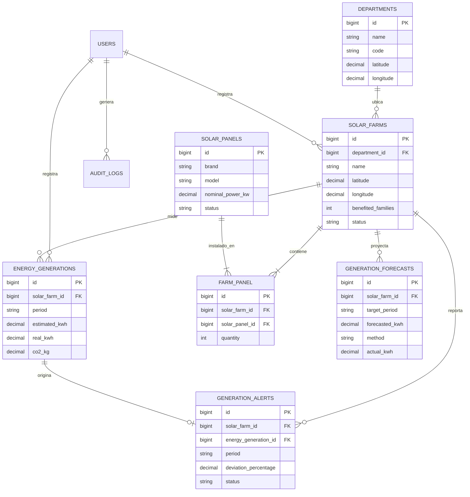

# Contratos de Interfaz — Congelados en la Hora 1 (17:00–18:00)

> **Este es el documento maestro que coordina a los 5 agentes de IA.**
>
> Define y congela los nombres de tablas, columnas, rutas, vistas, componentes Blade, sistema de diseño y roles
> para el **Sistema de Registro y Monitoreo de Generación Solar por Departamento (Guatemala)**.
>
> Una vez firmado a las 18:00, **cambiar algo de aquí requiere avisar al equipo completo.**

---

## 0. Decisiones de alcance

**El reto pide, en una frase:**
> Desarrollar y desplegar en la nube una plataforma web en Laravel para gestionar, monitorear y proyectar la generación solar en los 22 departamentos de Guatemala, integrando mapa interactivo, cálculo de reducción de CO₂ evitado (0.40 kg/kWh), detección automática de alertas ante desviaciones (≥20%) y una API REST pública documentada.

**Funciones PRINCIPALES (deben funcionar sin falta — máximo 5):**

1. **RF-01, RF-02, RF-03, RF-04, RF-05, RF-07 — Gestión de Activos Solares:** Catálogo precargado de los 22 departamentos de Guatemala, gestión de paneles (marca, modelo, potencia nominal en kW), registro completo de granjas solares con geolocalización (latitud y longitud), asociación de paneles con cálculo automático de capacidad instalada (kW) y registro de familias beneficiadas.
2. **RF-08, RF-09, RF-10 — Monitoreo de Generación y Reducción de CO₂:** Registro de mediciones energéticas por período (kWh estimado vs. real) con cálculo automático instantáneo de emisiones de CO₂ evitadas usando la norma exacta: **`0.40 kg de CO₂ por cada kWh real generado`**, visualizado tanto en kilogramos (kg) como en toneladas métricas (ton).
3. **RF-11, RF-12 — Dashboard Nacional y Reportes Comparativos:** Tablero ejecutivo con indicadores macro nacionales (total granjas, total paneles, capacidad instalada kW, kWh acumulados, familias beneficiadas, CO₂ evitado kg/ton), ranking departamental por generación y reportes comparativos por departamento.
4. **RF-13 — Mapa Interactivo de Guatemala:** Visualización cartográfica interactiva obligatoria (Leaflet.js + OpenStreetMap) con geolocalización de granjas en los 22 departamentos, filtros dinámicos, zoom, navegación y modal/popup con datos clave e indicadores por granja.
5. **RF-14 — Detección Automática de Anomalías y Alertas:** Disparador automático de alertas si $\text{Generación Real} \le 0.80 \times \text{Generación Esperada}$ (desviación $\ge 20\%$). Bandeja de consulta de alertas activas con porcentaje exacto de desviación, período y seguimiento.

**Funciones SECUNDARIAS (si da tiempo — máximo 4):**

1. **RF-15 — Módulo de Proyecciones de Generación Futura:** Estimación algorítmica justificada mediante Promedio Móvil Ponderado con Factor Estacional Solar Guatemalteco (diferenciando época seca con alta irradiancia [nov–abr] vs. época lluviosa [may–oct]), con comparación ex-post de datos proyectados vs. reales.
2. **RF-16 — API REST Pública y Documentada:** Endpoints JSON para consumo externo de departamentos, granjas, registros de generación y estadísticas generales, con documentación visual accesible en la app.
3. **Exportación de Reportes:** Generación de reportes departamentales en formato descargable (CSV / vista imprimible ejecutiva).
4. **Trazabilidad y Auditoría (OWASP A09):** Registro automático en base de datos de acciones críticas del sistema (creación, modificación, desactivación de activos y resolución de alertas).

**Explícitamente FUERA de alcance:**
- Registro individual o nominal de cada familia beneficiada (se maneja como conteo numérico consolidado por granja según especificación del reto).
- Modelos pesados de Deep Learning externos con librerías externas de Python (se utiliza un modelo algorítmico estadístico de estacionalidad solar implementado en el backend, 100 % auditable y explicable).
- Facturación eléctrica o pasarelas de pago.

**Elemento diferenciador / de innovación (para el 20 % de originalidad):**
> **"Simulador de Impacto Ecológico y Matriz Solar Departamental":** Un calculador interactivo en tiempo real que traduce los kWh solares y el CO₂ evitado a métricas tangibles para la población (árboles plantados equivalentes, consumo de hogares promedio de Guatemala), combinado con un mapa interactivo Leaflet de alto rendimiento con marcadores diferenciados por nivel de capacidad y un algoritmo de estacionalidad solar propio para el clima de Guatemala.

**Roles de usuario del sistema:**

| Rol | Qué puede hacer | Ruta de inicio |
|---|---|---|
| `admin` | Control total: gestión de usuarios, departamentos, granjas, paneles, generación, alertas, proyecciones y auditoría. | `/dashboard` |
| `operador` | Registro y edición de granjas, asignación de paneles, registro mensual de generación y resolución de alertas. | `/dashboard` |
| `visualizador` | Consulta pública/técnica: lectura de dashboard, mapa interactivo, reportes, proyecciones y consumo de la API REST. | `/dashboard` |

---

## 1. Esquema de base de datos — CONGELADO a las 18:00

> **Convención adoptada:** Nombres de tablas en plural en inglés, columnas en snake_case en inglés (estándar PSR y Laravel para evitar conflictos de pluralización en Eloquent). Todos los textos en pantalla y mensajes al usuario van en español.

| Tabla | Columnas principales | Relaciones | Notas / Reglas |
|---|---|---|---|
| `users` | `id`, `name`, `email`, `password`, `remember_token`, `timestamps` | `hasMany(SolarFarm)`, `hasMany(AuditLog)` | Con `spatie/laravel-permission` |
| `departments` | `id`, `name`, `code` (string 3, unique), `latitude` (10,7), `longitude` (10,7), `timestamps` | `hasMany(SolarFarm)` | Los 22 departamentos precargados por Seeder |
| `solar_panels` | `id`, `brand`, `model`, `nominal_power_kw` (decimal 8,3), `status` (enum: active, inactive, maintenance), `timestamps`, `softDeletes` | `belongsToMany(SolarFarm)` | Catálogo de paneles (RF-02) |
| `solar_farms` | `id`, `department_id`, `name`, `latitude` (10,7), `longitude` (10,7), `benefited_families` (int unsigned), `status` (enum: active, inactive, maintenance), `created_by` (foreignId users), `timestamps`, `softDeletes` | `belongsTo(Department)`, `belongsToMany(SolarPanel)`, `hasMany(EnergyGeneration)`, `hasMany(GenerationAlert)`, `hasMany(GenerationForecast)` | Capacidad calculada dinámicamente o con accessor (RF-03, 04, 07) |
| `farm_panel` | `id`, `solar_farm_id`, `solar_panel_id`, `quantity` (int unsigned), `timestamps` | Pivot entre `solar_farms` y `solar_panels` | $\text{Capacidad Total} = \sum(\text{quantity} \times \text{nominal\_power\_kw})$ (RF-05, 06) |
| `energy_generations` | `id`, `solar_farm_id`, `period` (string 7: YYYY-MM), `record_date` (date), `estimated_kwh` (decimal 12,2), `real_kwh` (decimal 12,2), `co2_kg` (decimal 12,2), `notes` (text, nullable), `created_by` (foreignId users), `timestamps` | `belongsTo(SolarFarm)`, `hasOne(GenerationAlert)` | $\text{co2\_kg} = \text{real\_kwh} \times 0.40$. Alerta si $\text{real\_kwh} \le 0.80 \times \text{estimated\_kwh}$ |
| `generation_alerts` | `id`, `solar_farm_id`, `energy_generation_id`, `period` (string 7), `estimated_kwh` (decimal 12,2), `real_kwh` (decimal 12,2), `deviation_percentage` (decimal 5,2), `status` (enum: active, resolved), `resolution_notes` (text, nullable), `resolved_by` (foreignId users, nullable), `resolved_at` (timestamp, nullable), `timestamps` | `belongsTo(SolarFarm)`, `belongsTo(EnergyGeneration)` | Se dispara automáticamente si déficit $\ge 20\%$ (RF-14) |
| `generation_forecasts` | `id`, `solar_farm_id`, `target_period` (string 7: YYYY-MM), `forecasted_kwh` (decimal 12,2), `method` (string), `actual_kwh` (decimal 12,2, nullable), `notes` (text, nullable), `timestamps` | `belongsTo(SolarFarm)` | Promedio móvil ponderado con estacionalidad solar (RF-15) |
| `audit_logs` | `id`, `user_id` (nullable), `action` (string), `model_type` (string, nullable), `model_id` (unsignedBigInteger, nullable), `ip_address` (string 45), `user_agent` (text, nullable), `payload` (json, nullable), `created_at` | `belongsTo(User)` | Obligatorio OWASP A09 |

**Convenciones técnicas:**
- Claves foráneas: `<tabla_singular>_id` con `constrained()->cascadeOnDelete()` donde aplique.
- Índices: índices en `solar_farm_id`, `department_id`, `period` y `status` para búsquedas rápidas en dashboard y reportes.
- Borrado lógico (`SoftDeletes`): en `solar_farms` y `solar_panels`.
- Cálculo de CO₂: Factor inmutable de `0.40` kg de CO₂ por cada kWh real. En toneladas: $\text{toneladas} = \text{co2\_kg} / 1000$.

**Diagrama Entidad-Relación:**

---

## 2. Rutas — CONGELADAS a las 18:00

> Las implementa **Agente A / E** en `routes/web.php` y `routes/api.php`. Los Agentes B y C se apegan estrictamente a estos nombres y parámetros.
> **Regla en Blade:** Usar siempre `route('nombre.de.ruta')`.

### Rutas Web (`routes/web.php`)

| Método | URI | Nombre de ruta | Controlador@método | Middleware | Vista que retorna |
|---|---|---|---|---|---|
| GET | `/` | `home` | `DashboardController@index` | `web` | `dashboard` |
| GET | `/dashboard` | `dashboard` | `DashboardController@index` | `auth` | `dashboard` |
| **Granjas** | | | | | |
| GET | `/farms` | `farms.index` | `SolarFarmController@index` | `auth` | `farms.index` |
| GET | `/farms/create` | `farms.create` | `SolarFarmController@create` | `auth, can:manage-farms` | `farms.create` |
| POST | `/farms` | `farms.store` | `SolarFarmController@store` | `auth, can:manage-farms` | redirect `farms.show` |
| GET | `/farms/{farm}` | `farms.show` | `SolarFarmController@show` | `auth` | `farms.show` |
| GET | `/farms/{farm}/edit` | `farms.edit` | `SolarFarmController@edit` | `auth, can:manage-farms` | `farms.edit` |
| PUT | `/farms/{farm}` | `farms.update` | `SolarFarmController@update` | `auth, can:manage-farms` | redirect `farms.show` |
| DELETE | `/farms/{farm}` | `farms.destroy` | `SolarFarmController@destroy` | `auth, can:manage-farms` | redirect `farms.index` |
| **Paneles** | | | | | |
| GET | `/panels` | `panels.index` | `SolarPanelController@index` | `auth` | `panels.index` |
| GET | `/panels/create` | `panels.create` | `SolarPanelController@create` | `auth, can:manage-panels` | `panels.create` |
| POST | `/panels` | `panels.store` | `SolarPanelController@store` | `auth, can:manage-panels` | redirect `panels.index` |
| GET | `/panels/{panel}/edit` | `panels.edit` | `SolarPanelController@edit` | `auth, can:manage-panels` | `panels.edit` |
| PUT | `/panels/{panel}` | `panels.update` | `SolarPanelController@update` | `auth, can:manage-panels` | redirect `panels.index` |
| DELETE | `/panels/{panel}` | `panels.destroy` | `SolarPanelController@destroy` | `auth, can:manage-panels` | redirect `panels.index` |
| **Generación** | | | | | |
| GET | `/generations` | `generations.index` | `EnergyGenerationController@index` | `auth` | `generations.index` |
| GET | `/generations/create` | `generations.create` | `EnergyGenerationController@create` | `auth, can:manage-generations` | `generations.create` |
| POST | `/generations` | `generations.store` | `EnergyGenerationController@store` | `auth, can:manage-generations` | redirect `generations.index` |
| GET | `/generations/{generation}`| `generations.show` | `EnergyGenerationController@show` | `auth` | `generations.show` |
| **Mapa Interactivo** | | | | | |
| GET | `/map` | `map.index` | `MapController@index` | `auth` | `map.index` |
| **Alertas** | | | | | |
| GET | `/alerts` | `alerts.index` | `GenerationAlertController@index` | `auth` | `alerts.index` |
| GET | `/alerts/{alert}` | `alerts.show` | `GenerationAlertController@show` | `auth` | `alerts.show` |
| POST | `/alerts/{alert}/resolve` | `alerts.resolve` | `GenerationAlertController@resolve` | `auth, can:manage-alerts` | redirect `alerts.index` |
| **Reportes** | | | | | |
| GET | `/reports` | `reports.index` | `ReportController@index` | `auth` | `reports.index` |
| GET | `/reports/department/{department}` | `reports.department` | `ReportController@department` | `auth` | `reports.department` |
| GET | `/reports/export` | `reports.export` | `ReportController@export` | `auth` | download file |
| **Proyecciones** | | | | | |
| GET | `/forecasts` | `forecasts.index` | `ForecastController@index` | `auth` | `forecasts.index` |
| POST | `/forecasts/generate` | `forecasts.generate` | `ForecastController@generate` | `auth, can:manage-forecasts` | redirect `forecasts.index` |
| **Documentación API** | | | | | |
| GET | `/api-docs` | `api.docs` | `ApiDocsController@index` | `web` | `api-docs.index` |

---

### Rutas API REST (`routes/api.php`)

> Prefix: `/api/v1` — Respuestas en formato uniforme `{ "success": true, "data": [...] }`.

| Método | URI | Nombre de ruta | Controlador@método | Descripción |
|---|---|---|---|---|
| GET | `/api/v1/departments` | `api.v1.departments.index` | `Api\DepartmentController@index` | Lista los 22 departamentos con totales agregados |
| GET | `/api/v1/departments/{id}`| `api.v1.departments.show` | `Api\DepartmentController@show` | Detalle departamental con sus granjas |
| GET | `/api/v1/farms` | `api.v1.farms.index` | `Api\SolarFarmController@index` | Lista de granjas con capacidad instalada y ubicación |
| GET | `/api/v1/farms/{id}` | `api.v1.farms.show` | `Api\SolarFarmController@show` | Detalle de granja con paneles y mediciones |
| GET | `/api/v1/generations` | `api.v1.generations.index` | `Api\EnergyGenerationController@index` | Histórico de generación y CO₂ evitado |
| GET | `/api/v1/statistics` | `api.v1.statistics.index` | `Api\StatisticController@index` | Totales nacionales (kW, kWh, CO₂, familias, alertas) |
| GET | `/api/v1/alerts` | `api.v1.alerts.index` | `Api\AlertController@index` | Listado de alertas activas |

---

## 3. Vistas y Componentes — CONGELADAS a las 18:00

> El **Agente C (Antigravity)** construye estas vistas y componentes. El **Agente B (Codex)** sabe exactamente qué variables mandar a cada vista.

| Vista (`resources/views/...`) | Variables que recibe | Qué renderiza |
|---|---|---|
| `layouts.app` | `$title` (string), `$slot` | Shell general: sidebar responsivo, topbar con usuario y alertas pendientes, contenedor principal |
| `dashboard` | `$stats` (array con totales nacionales), `$departmentRanking` (collection), `$monthlyComparison` (array), `$activeAlerts` (collection), `$mapFarms` (json) | Dashboard con 6 tarjetas KPI, gráfico de barras/líneas real vs esperada, mapa compacto y tabla de alertas |
| `farms.index` | `$farms` (LengthAwarePaginator), `$departments` (collection), `$filters` (array) | Listado de granjas con filtro por departamento y estado, buscador y badges de capacidad |
| `farms.create` | `$departments` (collection), `$panels` (collection) | Formulario de alta con selector de departamento, coordenadas lat/lng y asignación dinámica de paneles |
| `farms.edit` | `$farm` (SolarFarm con paneles), `$departments` (collection), `$panels` (collection) | Edición de granja, actualización de ubicación y reasignación de paneles |
| `farms.show` | `$farm` (con paneles, mediciones históricas, alertas y proyecciones) | Ficha técnica: capacidad total kW, paneles instalados, histórico de kWh, CO₂ evitado y familias |
| `panels.index` | `$panels` (LengthAwarePaginator) | Catálogo de paneles con marca, modelo, potencia nominal kW y estado |
| `panels.create` / `.edit` | `$panel` (si es edit) | Formulario para ingresar marca, modelo, potencia en kW y estado |
| `generations.index`| `$generations` (LengthAwarePaginator), `$farms` (collection), `$filters` (array) | Tabla histórica de mediciones con badge de desviación y CO₂ calculado |
| `generations.create`| `$farms` (collection) | Formulario: selección de granja, período (mes/año), fecha, kWh estimado y kWh real |
| `map.index` | `$departments` (collection), `$farmsJson` (string JSON con lat, lng, nombre, capacidad, familias, alertas) | Vista completa del Mapa Interactivo de Guatemala con filtros laterales por departamento y capas |
| `alerts.index` | `$alerts` (LengthAwarePaginator), `$farms` (collection), `$stats` (array) | Bandeja de alertas por déficit ≥ 20%, con semáforo y modal de resolución |
| `reports.index` | `$summaryByDepartment` (collection), `$nationalStats` (array) | Matriz departamental completa (granjas, paneles, kW, kWh, familias, CO₂ kg/ton) |
| `forecasts.index` | `$farms` (collection), `$forecasts` (LengthAwarePaginator), `$selectedFarm` | Visualización de proyecciones futuras vs histórico, y botón de cálculo algorítmico |
| `api-docs.index` | — | Documentación interactiva de los endpoints REST con ejemplos de JSON de respuesta |

### Componentes Blade Reutilizables (`resources/views/components/`)
*(Entrega prioritaria del Agente C antes de las 19:00)*

1. `<x-card>` — Contenedor blanco/slate con bordes suaves, padding uniforme y encabezado opcional.
2. `<x-kpi-card title="..." value="..." subtitle="..." icon="..." trend="..." variant="solar|eco|danger|info">` — Tarjeta métrica de impacto.
3. `<x-button variant="primary|secondary|danger|outline" size="sm|md|lg" type="button|submit">` — Botones del sistema.
4. `<x-input name="..." label="..." type="text|number|date" :error="$errors->first('...')" required>` — Input estándar con label y error de validación automático.
5. `<x-select name="..." label="..." :options="$options" :error="$errors->first('...')">` — Select estándar accesible.
6. `<x-table>` + `<x-table.th>` + `<x-table.tr>` + `<x-table.td>` — Tabla responsiva con hover y scroll horizontal.
7. `<x-badge variant="success|warning|danger|neutral|solar">` — Pills de estado y porcentajes.
8. `<x-alert type="success|error|warning|info" :message="...">` — Alertas de sesión (flash messages).
9. `<x-empty-state title="..." message="..." icon="..." actionLabel="..." actionUrl="...">` — Estado vacío amigable cuando no hay registros.
10. `<x-modal name="..." title="...">` — Modal liviano con Alpine.js o vanilla CSS/JS.

---

## 4. Sistema de Diseño — CONGELADO a las 18:00

| Elemento | Token / Valor acordado | Uso específico |
|---|---|---|
| **Color Primario (Solar)** | Amber 500 (`#F59E0B`) / Amber 600 (`#D97706`) | Botones principales, acentos solares, energía generada |
| **Color Ecológico (Eco)** | Emerald 500 (`#10B981`) / Emerald 600 (`#059669`) | Indicadores de CO₂ evitado, estados óptimos, éxito |
| **Color Alerta / Peligro**| Rose 500 (`#F43F5E`) / Red 600 (`#DC2626`) | Alertas por déficit $\ge 20\%$, acciones destructivas |
| **Color Información** | Sky 500 (`#0EA5E9`) / Cyan 600 (`#0891B2`) | Familias beneficiadas, datos de departamento |
| **Superficie / Fondo** | Light: Slate 50 (`#F8FAFC`) / Dark: Slate 900 (`#0F172A`) | Fondos de página |
| **Tarjetas / Contenedores**| Light: White (`#FFFFFF`) / Dark: Slate 800 (`#1E293B`) | Paneles y cards elevadas |
| **Bordes** | Slate 200 (`#E2E8F0`) / Dark: Slate 700 (`#334155`) | Delimitadores de tabla y campos |
| **Tipografía** | `Inter`, `Figtree` o `ui-sans-serif, system-ui` | Fuente limpia, moderna y altamente legible |
| **Radio de bordes** | `rounded-xl` (12px) en tarjetas y `rounded-lg` (8px) en botones/inputs | Consistencia suave y profesional |
| **Sombras** | `shadow-sm` en tarjetas regulares; `shadow-lg` en modales y popups de mapa | Jerarquía de elevación sutil |
| **Mapa** | Estilo CartoDB Positron o OpenStreetMap Standard | Mapa claro, limpio, con alto contraste para pines solares |

---

## 5. Roles, Permisos y Datos Semilla — CONGELADOS a las 18:00

| Rol | Permisos asignados |
|---|---|
| `admin` | `manage-users`, `manage-departments`, `manage-farms`, `manage-panels`, `manage-generations`, `manage-alerts`, `manage-forecasts`, `view-reports`, `view-api` |
| `operador` | `manage-farms`, `manage-panels`, `manage-generations`, `manage-alerts`, `manage-forecasts`, `view-reports`, `view-api` |
| `visualizador`| `view-reports`, `view-api` |

**Usuarios Semilla en `DatabaseSeeder`:**

| Nombre | Correo | Contraseña | Rol |
|---|---|---|---|
| Administrador Nacional | `admin@solarguatemala.gob.gt` | `Solar2026!Admin` | `admin` |
| Operador Regional | `operador@solarguatemala.gob.gt` | `Operador2026!` | `operador` |
| Evaluador Jurado | `evaluador@umg.edu.gt` | `Evaluador2026!` | `visualizador` |

---

## 6. Algoritmo de Proyección Justificado (RF-15)

Para dar cumplimiento pleno y riguroso a la sección 8 y RF-15 del reto sin complejidades innecesarias, el sistema implementará en `app/Services/SolarForecastService.php`:

### Método: **Promedio Móvil Ponderado con Factor de Estacionalidad Guatemalteca (SMA-SF)**
- **Fundamento climatológico:** Guatemala tiene un régimen solar bimodal bien documentado (INSIVUMEH):
  - **Época Seca (Noviembre a Abril):** Alta insolación ($K_{\text{estacional}} \approx 1.15 \text{ a } 1.25$).
  - **Época Lluviosa (Mayo a Octubre):** Nubosidad frecuente y precipitaciones vespertinas ($K_{\text{estacional}} \approx 0.85 \text{ a } 0.92$).
- **Fórmula:**
  $$\text{Proyección}(m) = \left( \sum_{i=1}^{n} w_i \times \text{Real}_{m-i} \right) \times K_{\text{estacional}}(m) \times \left(\frac{\text{Capacidad Actual}}{\text{Capacidad Media Histórica}}\right)$$
  Donde $w_i$ asigna mayor peso a los meses más recientes y $K_{\text{estacional}}$ ajusta por radiación solar histórica del mes a proyectar.
- **Ventaja evaluativa:** Es 100 % defendible matemáticamente en 60 segundos ante el jurado, produce cifras realistas y compara con precisión el margen de error ex-post cuando se ingresan datos reales.

---

## 7. Asignación de Trabajo por Agentes

| Agente | Operador | Bloque 1 (18:20–21:30) | Bloque 2 (22:00–23:30) |
|---|---|---|---|
| **A / E — Claude** | Carlos & Andy | Migraciones (8 tablas), Modelos Eloquent con `$fillable` y relaciones, Seeders (22 departamentos con lat/long y datos demo), `routes/web.php` y `routes/api.php`, Policies de autorización | Integración de PRs, deploy a producción, hardening OWASP Top 10:2025, revisión de pull requests |
| **B — Codex** | Carlos | Controladores base (`SolarFarmController`, `SolarPanelController`, `EnergyGenerationController`, `GenerationAlertController`), `FormRequest`s con validación estricta y lógica de alerta automática | `ReportController`, `ForecastController` con `SolarForecastService`, endpoints de la API REST v1 |
| **C — Antigravity** | Andy *(yo)* | Layout `layouts.app`, configuración Tailwind, suite de componentes Blade (`<x-card>`, `<x-kpi-card>`, `<x-button>`, `<x-table>`, `<x-badge>`), vistas de Dashboard y Mapa Interactivo con Leaflet.js | Maquetación fina de vistas CRUD, estados vacíos, página de documentación de API REST y responsividad (móvil/tablet/desktop) |
| **D — Antigravity** | Carlos | Pipeline de despliegue a la nube, verificación de HTTPS y conexión MySQL, recopilación de capturas de pantalla de MCP | Bitácora de Prompts (`04-BITACORA-PROMPTS.md`), diapositivas de presentación, auditoría de seguridad final |

---

## Firma y Congelamiento

- [x] Esquema de base de datos congelado — 18:00
- [x] Rutas y endpoints REST congelados — 18:00
- [x] Nombres de vistas y componentes Blade congelados — 18:00
- [x] Sistema de diseño congelado — 18:00
- [x] Alcance (principales + secundarias + fuera de alcance) congelado — 18:00

**Aprobado por el equipo:** Andy Aquino · Carlos
