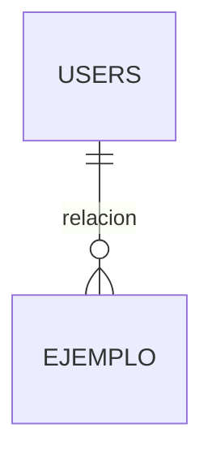

# Contratos de Interfaz — Se llenan en la Hora 1 (17:00–18:00)

> **Este es el documento que decide si las 12 horas siguientes fluyen o se pelean.**
>
> Con 4 agentes en paralelo, el cuello de botella no es escribir código: es que dos agentes
> asuman cosas distintas sobre el mismo nombre. Este archivo congela los nombres.
>
> Una vez firmado a las 18:00, **cambiar algo de aquí requiere avisar al equipo completo.**

---

## 0. Decisiones de alcance (10 minutos)

**El reto pide, en una frase:**
> `<________>`

**Funciones PRINCIPALES (deben funcionar sin falta — máximo 5):**

1.
2.
3.
4.
5.

**Funciones SECUNDARIAS (si da tiempo — máximo 4):**

1.
2.
3.
4.

**Explícitamente FUERA de alcance:**

-
-

**Elemento diferenciador / de innovación** (para el 20 % de originalidad):
> `<qué hace este sistema que nadie más va a hacer>`

**Roles de usuario del sistema:**

| Rol | Qué puede hacer |
|---|---|
| | |
| | |

---

## 1. Esquema de base de datos — CONGELADO a las 18:00

> Lo define el **Agente A** y nadie más lo toca. Si alguien necesita una columna, la pide.

| Tabla | Columnas | Relaciones | Notas |
|---|---|---|---|
| `users` | id, name, email, password, timestamps | hasMany(...) | + `spatie/laravel-permission` |
| `auditorias` | id, usuario_id, accion, modelo, modelo_id, ip, user_agent, timestamps | belongsTo(users) | Obligatoria (OWASP A09) |
| | | | |
| | | | |

**Convenciones acordadas:**
- Nombres de tabla: plural, snake_case, en `<español / inglés>` ← **elegir uno y no mezclar**
- Claves foráneas: `<entidad>_id`
- Estados: columna `estado` de tipo `enum`, valores en minúscula
- Fechas: `created_at` / `updated_at` estándar de Laravel
- Borrado lógico (`SoftDeletes`) en: `<tablas>`

**Diagrama ER inicial:**

---

## 2. Rutas — CONGELADAS a las 18:00

> Las escribe el **Agente A** en `routes/web.php`. B, C y D las consumen tal cual.

| Método | URI | Nombre de ruta | Controlador@método | Middleware | Vista que retorna |
|---|---|---|---|---|---|
| GET | `/dashboard` | `dashboard` | `DashboardController@index` | `auth` | `dashboard` |
| GET | `/<recurso>` | `<recurso>.index` | `<X>Controller@index` | `auth`, `can:viewAny,...` | `<recurso>.index` |
| GET | `/<recurso>/create` | `<recurso>.create` | `@create` | | `<recurso>.create` |
| POST | `/<recurso>` | `<recurso>.store` | `@store` | | redirect |
| GET | `/<recurso>/{id}` | `<recurso>.show` | `@show` | | `<recurso>.show` |
| GET | `/<recurso>/{id}/edit` | `<recurso>.edit` | `@edit` | | `<recurso>.edit` |
| PUT | `/<recurso>/{id}` | `<recurso>.update` | `@update` | | redirect |
| DELETE | `/<recurso>/{id}` | `<recurso>.destroy` | `@destroy` | | redirect |

**Regla:** en Blade se usa **siempre** `route('nombre.de.ruta')`, nunca una URL escrita a mano.
Así el Agente C puede maquetar sin que exista todavía el controlador del Agente B.

---

## 3. Vistas — CONGELADAS a las 18:00

> El Agente C construye estas vistas. El Agente B sabe exactamente qué nombre retornar
> y qué variables mandar, sin tener que preguntar.

| Vista (`resources/views/...`) | Variables que recibe | Descripción |
|---|---|---|
| `layouts.app` | `$title` | Layout base: sidebar, topbar, slot de contenido |
| `dashboard` | `$metricas` (array) | Tarjetas de resumen |
| `<recurso>.index` | `$items` (paginado) | Tabla con filtros y paginación |
| `<recurso>.create` | `$opciones` | Formulario de creación |
| `<recurso>.edit` | `$item`, `$opciones` | Formulario de edición |
| `<recurso>.show` | `$item` | Detalle |

**Componentes Blade compartidos que el Agente C entrega primero (antes de las 19:00),
para que todos maqueten igual:**

- `<x-card>`
- `<x-boton variant="primary|secondary|danger">`
- `<x-input name label :error>`
- `<x-select name label :options>`
- `<x-tabla>` + `<x-tabla.fila>`
- `<x-badge estado="...">`
- `<x-alerta tipo="exito|error|info">`
- `<x-estado-vacio titulo mensaje>`
- `<x-modal>`

---

## 4. Sistema de diseño — CONGELADO a las 18:00

| Elemento | Valor acordado |
|---|---|
| Color primario | `<#______>` |
| Color secundario | `<#______>` |
| Éxito / Advertencia / Error | `<#______>` / `<#______>` / `<#______>` |
| Fondo / Superficie | `<#______>` / `<#______>` |
| Tipografía | `<Inter / Figtree / ...>` |
| Radio de bordes | `rounded-lg` |
| Sombras | `shadow-sm` en tarjetas, `shadow-lg` en modales |
| Espaciado base | múltiplos de 4 |
| Modo oscuro | Sí / No ← decidir ahora, no a medias |

---

## 5. Roles y permisos — CONGELADOS a las 18:00

| Rol | Permisos | Ruta de inicio tras login |
|---|---|---|
| `admin` | todos | `/dashboard` |
| `<rol2>` | | |
| `<rol3>` | | |

**Usuarios semilla para la demo** (van en `DatabaseSeeder`, con contraseñas decentes):

| Correo | Contraseña | Rol |
|---|---|---|
| admin@`<proyecto>`.com | | admin |
| | | |

---

## 6. Asignación inicial de trabajo

| Agente | Bloque 1 (18:20–21:30) | Bloque 2 (22:00–23:30) |
|---|---|---|
| **A — Claude (Andy)** | Migraciones, modelos, roles/permisos, auth, rutas, Policies, deploy inicial | Integración, revisión de PRs, hardening OWASP |
| **B — Codex (Carlos)** | Controladores y FormRequests del módulo principal | Funciones secundarias, reportes |
| **C — Antigravity (Andy)** | Layout + componentes compartidos + pantallas principales | Pulido visual, responsividad, estados vacíos |
| **D — Antigravity (Carlos)** | ERS, diagrama ER, seeders, configuración de despliegue | Manual de usuario, bitácora, diapositivas, auditoría de seguridad |

---

## Firma de congelamiento

- [ ] Esquema de base de datos congelado — hora: `____`
- [ ] Rutas congeladas — hora: `____`
- [ ] Nombres de vistas congelados — hora: `____`
- [ ] Sistema de diseño congelado — hora: `____`
- [ ] Alcance congelado (principales + secundarias) — hora: `____`

**Acordado por:** Andy `____` · Carlos `____`
