# Diapositivas de la Presentación Oficial — K'in Solar Guatemala

> **Competencia de Programación con IA — Universidad Mariano Gálvez de Guatemala**
> **Tiempo total:** 10 a 12 minutos cronometrados (objetivo: 12:00)
> **Presentadores:** Andy Aquino & Carlos
> **URL de la presentación interactiva:** [`https://kin-solar-guatemala.duckdns.org/presentacion.html`](https://kin-solar-guatemala.duckdns.org/presentacion.html)
> **Versión PowerPoint editable:** `docs/export/Presentacion-Kin-Solar-Guatemala.pptx` (mismo orden y contenido)
> **Guion palabra por palabra:** `docs/08-GUION-PRESENTACION.md`

Esta versión reorganiza la anterior bajo un criterio explícito: **todo lo técnico y documental
se presenta primero, en diapositivas; la demostración del sistema en sí queda al final, en vivo,
fuera de PowerPoint.** Las tres diapositivas que antes intercalaban detalle de demo (Dashboard,
Alertas, Proyecciones) se consolidaron en una única diapositiva de transición ("Módulos del
Sistema") justo antes de la demo real. Se agregaron tres diapositivas nuevas de referencia
(Estándares/ERS-ERD, Estructura de la Documentación, Flujo de Trabajo del Repositorio) y una de
evidencia visual del error 403, todas con capturas reales del sistema — no maquetas.

---

## Estructura de Diapositivas y Mapeo a la Rúbrica

```mermaid
graph LR
    D1[1. Portada & Problema] --> D2["2. El nombre K'in Solar"]
    D2 --> D3[3. Solucion & Diferenciadores]
    D3 --> D4[4. Arquitectura & Documentacion]
    D4 --> D5[5. Estandares: ERS + ERD]
    D5 --> D6[6. Estructura de Documentacion]
    D6 --> D7[7. Flujo de Trabajo del Repo]
    D7 --> D8[8. Innovacion: MCP Propio]
    D8 --> D9[9. Elementos Plus]
    D9 --> D10[10. Seguridad OWASP 2025]
    D10 --> D11[11. Evidencia: Error 403]
    D11 --> D12[12. Metodologia: 5 Agentes IA]
    D12 --> D13[13. Modulos del Sistema]
    D13 --> DEMO[["DEMOSTRACION EN VIVO (navegador)"]]
    DEMO --> D14[14. Roles & Cierre]
    D14 --> D15[15. Preguntas]
```

| Diapositiva | Criterio de rúbrica que cubre | Peso |
|---|---|---|
| 2 — El nombre K'in Solar | Originalidad, profesionalismo e innovación | 20 % |
| 3 — Solución y diferenciadores | Originalidad e innovación | 20 % |
| 4, 5, 6 — Arquitectura, Estándares, Estructura de Documentación | Documentación asociada al proyecto | 10 % |
| 7 — Flujo de trabajo del repositorio | Uso de IA + Originalidad (control de versiones) | 20 % |
| 8, 9 — MCP propio y elementos plus | Originalidad + Uso de IA | 20 % + 20 % |
| 10, 11 — Seguridad OWASP + evidencia 403 | Funcionalidad (seguridad no funcional) | 25 % |
| 12 — Metodología 5 agentes IA | Uso de Inteligencia Artificial | 20 % |
| 13 + Demostración en vivo | Funcionalidad y cumplimiento de requerimientos | 25 % |
| Demostración en vivo | Diseño de UI/UX | 15 % |
| Todas | Presentación: claridad, estructura, recursos visuales, demo en vivo | 10 % |

---

### Diapositiva 1 — Portada & El Problema Nacional (0:00 – 0:40)
- **Título:** K'in Solar Guatemala: Trazabilidad, Monitoreo y Proyección Energética Departamental
- **Contenido:** el problema (22 departamentos fragmentados, sin detección de fallas, sin trazabilidad de CO₂, sin proyección), badges del stack.
- **Orador:** Carlos

### Diapositiva 2 — El Nombre "K'in Solar": Origen y Originalidad (0:40 – 1:15)
- **Título:** ¿Por Qué "K'in"?
- **Contenido:** K'in = signo maya del Sol/Día; el glifo del logo es el jeroglífico real; identidad como elemento de originalidad.
- **Orador:** Carlos

### Diapositiva 3 — La Solución y los Factores Diferenciadores (1:15 – 1:55)
- **Título:** Cinco Elementos Clave de K'in Solar
- **Contenido:** 22 departamentos con mapa Leaflet, modelo SMA-SF, factor CNEE 0.40, alertas con mutex (`lockForUpdate`), servidor MCP propio.
- **Orador:** Carlos

### Diapositiva 4 — Arquitectura de Software y Documentación del Proyecto (1:55 – 2:30)
- **Título:** Arquitectura Escalable y Documentación Trazable
- **Contenido:** stack tecnológico (AWS EC2, Nginx, Laravel 13, MySQL 8) + resumen de la documentación versionada.
- **Orador:** Andy

### Diapositiva 5 — Estándares Aplicados y los Artefactos que Construimos con Ellos (2:30 – 3:00) — NUEVA
- **Título:** Estándares y Normas: ERS + ERD
- **Contenido:** tabla explícita Estándar → Artefacto: IEEE 830/29148 → **ERS** completo; UML 2.5 → **ERD** + diagramas de casos de uso/secuencia/actividades (con el ERD real embebido como imagen); ISO/IEC 25010 → Atributos de Calidad del ERS; OWASP Top 10:2025 → documento de seguridad + checklist por PR.
- **Orador:** Andy

### Diapositiva 6 — Estructura Completa de la Documentación (docs/) (3:00 – 3:25) — NUEVA
- **Título:** Estructura Completa de la Documentación
- **Contenido:** los 13 documentos de `docs/` con una línea de descripción cada uno, todos enlazados desde el README.
- **Orador:** Andy

### Diapositiva 7 — Cómo Trabajamos el Repositorio: Ramas, PRs y Commits (3:25 – 3:55) — NUEVA
- **Título:** Disciplina de Equipo
- **Contenido:** las 10 reglas del proyecto, ejemplos reales de Conventional Commits (con trailer de coautoría de IA), plantilla de PR obligatoria, evidencia en números.
- **Orador:** Carlos

### Diapositiva 8 — Innovación de Alto Impacto: Servidor MCP Propio (3:55 – 4:30)
- **Título:** La IA como Usuario Activo del Sistema
- **Contenido:** servidor Node.js, 3 herramientas, flujo completo de autenticación y trazabilidad vía `audit_logs`.
- **Orador:** Carlos

### Diapositiva 9 — Elementos Plus: Más Allá de las 17 RF Originales (4:30 – 5:00)
- **Título:** Lo que Nadie nos Pidió, pero Construimos
- **Contenido:** Laboratorio SCADA, campanita Web Audio API, tema claro/oscuro real, navegación móvil nativa, cliente de API externo, identidad maya-solar.
- **Orador:** Andy

### Diapositiva 10 — Seguridad: Cumplimiento Estricto OWASP Top 10:2025 (5:00 – 5:20)
- **Título:** Blindaje de Seguridad Innegociable
- **Contenido:** A01, A02, A04, A05, A06, A09 con su control concreto en el código.
- **Orador:** Carlos

### Diapositiva 11 — Evidencia en Vivo: Error 403 (5:20 – 5:35) — NUEVA
- **Título:** Control de Acceso Real: Error 403 por Rol
- **Contenido:** captura real del error 403 al intentar acceso no autorizado, con explicación de qué pasó y qué queda registrado en `audit_logs`.
- **Orador:** Carlos

### Diapositiva 12 — Metodología: 5 Agentes de IA en Paralelo (5:35 – 6:15)
- **Título:** Desarrollo Incremental y Disciplinado
- **Contenido:** los 5 agentes, ramas y PRs, bitácora de prompts, cómo se coordinaron sin conflictos.
- **Orador:** Carlos

### Diapositiva 13 — Los Módulos que Vamos a Presentar en Vivo (6:15 – 6:35) — NUEVA (reemplaza 3 diapositivas de demo)
- **Título:** Transición a la Demostración
- **Contenido:** 8 tarjetas numeradas (Dashboard, Mapa, Granjas/Paneles, Registro de Generación, Alertas, Reportes, Proyección SMA-SF, API+MCP) y una franja de cierre: *"A continuación: demostración en vivo sobre la URL pública."*
- **Orador:** Ambos

### — DEMOSTRACIÓN EN VIVO (6:35 – 10:35, fuera de las diapositivas) —
Se cierra o minimiza PowerPoint/el navegador de la presentación y se navega la URL pública real,
cubriendo los 8 módulos de la Diapositiva 13. Ver la secuencia exacta de clics en
`docs/08-GUION-PRESENTACION.md`, Bloque 14.

### Diapositiva 14 — Roles del Equipo, Conclusión (10:35 – 11:20)
- **Título:** Equipo de Desarrollo & Conclusión
- **Contenido:** roles de Andy y Carlos, frase de cierre, datos de acceso para el jurado.
- **Orador:** Ambos

### Diapositiva 15 — Ronda de Preguntas (11:20 – 12:00)
- **Título:** ¿Preguntas? Aquí Van Algunas Respuestas Listas
- **Contenido:** banco de 6 preguntas/respuestas visible en pantalla.
- **Orador:** Ambos

---

## Archivos `.md` que conviene tener a la mano durante la presentación

No hace falta proyectar el repositorio completo, pero sí tener **pestañas abiertas de antemano**
con estos archivos renderizados en GitHub (no en crudo), para abrirlos en 2-3 segundos si el jurado
pide evidencia:

| Archivo | Cuándo mostrarlo | Qué demuestra |
|---|---|---|
| `README.md` | Apertura, si preguntan "¿dónde empiezo a ver el proyecto?" | Profesionalismo, credenciales de acceso, badges |
| `docs/03-PLANTILLA-ERS.md` | Diapositivas 5-6 (estándares/documentación) | ERS completo con objetivos, RF/RNF, ISO 25010, casos de uso, diagramas |
| `docs/02-SEGURIDAD-OWASP-2025.md` | Diapositivas 10-11 (seguridad) | Los 10 controles documentados y verificados |
| `docs/04-BITACORA-PROMPTS.md` | Diapositiva 12 (metodología IA) | Evidencia cronológica de uso de IA con corrección humana |
| `docs/05-CHECKLIST-RUBRICA.md` | Solo si el jurado pregunta "¿cómo se autoevaluaron?" | Honestidad: incluye ítems marcados como pendientes, no solo logros |
| `docs/09-MANUAL-USUARIO.md` | Solo si preguntan por el manual de usuario explícitamente | Cumple el ítem literal de la rúbrica de Documentación |
| Un Pull Request abierto cualquiera | Diapositiva 7 y 12 | Plantilla de PR con checklist OWASP y evidencia de IA llenos |

**Recomendación práctica:** abrir estas 5-7 pestañas de GitHub *antes* de subir al frente, en el mismo
orden en que aparecen en la tabla, para no perder tiempo buscando durante la presentación.
