# Diapositivas de la Presentación Oficial — K'in Solar Guatemala

> **Competencia de Programación con IA — Universidad Mariano Gálvez de Guatemala**
> **Tiempo total:** 10 minutos cronometrados
> **Presentadores:** Andy Aquino & Carlos
> **URL de la presentación interactiva:** [`https://kin-solar-guatemala.duckdns.org/presentacion.html`](https://kin-solar-guatemala.duckdns.org/presentacion.html)

---

## Estructura de Diapositivas

```mermaid
graph LR
    D1[1. Portada & Problema] --> D2[2. Vision & Solucion]
    D2 --> D3[3. Arquitectura & Stack]
    D3 --> D4[4. Demo: Dashboard & Mapa]
    D4 --> D5[5. Demo: Alertas & Operacion]
    D5 --> D6[6. Demo: Modelo SMA-SF]
    D6 --> D7[7. Innovacion: MCP Propio]
    D7 --> D8[8. Seguridad OWASP 2025]
    D8 --> D9[9. Metodologia: 5 Agentes IA]
    D9 --> D10[10. Cierre & Preguntas]
```

---

### Diapositiva 1 — Portada & El Problema Nacional (0:00 - 0:45)
- **Título:** K'in Solar Guatemala: Trazabilidad, Monitoreo y Proyección Energética Departamental
- **Subtítulo:** Sistema Centralizado de Generación Fotovoltaica en los 22 Departamentos de Guatemala
- **El Problema:**
  - 22 departamentos con generación solar fragmentada y registros manuales en hojas de cálculo.
  - Cero detección en tiempo real de pérdidas o fallas en inversores/paneles.
  - Desconocimiento del impacto ambiental real (CO₂ evitado y familias beneficiadas).
  - Imposibilidad institucional de proyectar la producción energética futura ante el cambio climático.
- **Orador:** Carlos

---

### Diapositiva 2 — La Solución y Factores Diferenciadores (0:45 - 1:45)
- **Título:** Cinco Elementos Innovadores de K'in Solar
- **Contenido:**
  1. **Territorio Georreferenciado:** Mapa interactivo con Leaflet.js de los 22 departamentos, pines proporcionales a kW y contadores sin scroll.
  2. **Inteligencia Predictiva (SMA-SF):** Media Móvil Ponderada con factor estacional bimodal de Guatemala (1.20 época seca / 0.88 época lluviosa).
  3. **Impacto Ambiental Riguroso:** Factor normativo exacto de 0.40 kg CO₂/kWh (CNEE) totalizado en kg y toneladas métricas.
  4. **Motor de Alertas Autónomo:** Detección en base de datos con `lockForUpdate` cuando la generación real es ≤ 80% de la esperada (déficit ≥ 20%).
  5. **Ecosistema MCP Propio:** Servidor Model Context Protocol nativo que permite a cualquier IA externa consultar y registrar mediciones en lenguaje natural.
- **Orador:** Carlos

---

### Diapositiva 3 — Arquitectura de Software y Modelo de Datos (1:45 - 2:30)
- **Título:** Arquitectura Escalable, Resiliente y Nube AWS
- **Contenido:**
  - **Stack:** PHP 8.3 / Laravel 12 + MySQL 8 + Tailwind CSS v4 + Vite + Leaflet + Chart.js.
  - **Infraestructura Nube:** Instancia AWS EC2 Ubuntu 24.04, Nginx 1.24, Certbot SSL Let's Encrypt, dominio `kin-solar-guatemala.duckdns.org`.
  - **Base de Datos:** 8 entidades relacionales con integridad referencial estricta (`departments`, `solar_panels`, `solar_farms`, `farm_panel`, `energy_generations`, `generation_alerts`, `generation_forecasts`, `audit_logs`).
  - **Patrón Arquitectónico:** Controladores delgados + Servicios de Dominio (`CarbonOffsetService`, `AlertEvaluationService`, `ForecastService`, `BackendAuditService`, `BackendAccessService`).
- **Orador:** Andy

---

### Diapositiva 4 — Demostración en Vivo: Dashboard & Territorio (2:30 - 3:45)
- **Título:** Demostración en Producción: Visión Macro y Micro
- **Puntos a proyectar:**
  - **Dashboard Nacional:** 6 KPIs consolidados (Generación acumulada, CO₂ evitado, Granjas, Paneles, kW y Familias).
  - **Ranking Departamental:** Participación porcentual y desglose por departamento con gráfico de doble curva real vs esperada.
  - **Mapa Interactivo:** Filtrado instantáneo por departamento, pines según kW, drawer lateral con cero scroll horizontal.
- **Orador:** Andy

---

### Diapositiva 5 — Demostración en Vivo: Operación y Alertas (3:45 - 5:00)
- **Título:** Monitoreo Autónomo de Anomalías Energéticas
- **Puntos a proyectar:**
  - Registro de medición en vivo demostrando el cálculo automático de CO₂ (factor 0.40).
  - Provocación de un déficit del 25% → Demostración del disparo inmediato de alerta roja.
  - Resolución de alertas con trazabilidad obligatoria y registro de justificación técnica.
  - Reporte consolidado de los 22 departamentos y exportación a CSV con BOM UTF-8.
- **Orador:** Andy

---

### Diapositiva 6 — Inteligencia Predictiva: Modelo SMA-SF (5:00 - 6:30)
- **Título:** Modelo SMA-SF (Seasonal Moving Average - Solar Forecast)
- **Contenido:**
  - Fórmula: $\text{Base} = 0.50 \cdot M_{t-1} + 0.30 \cdot M_{t-2} + 0.20 \cdot M_{t-3}$
  - Ajuste Estacional: $\text{Proyección} = \text{Base} \times F_{\text{estación}}$ (1.20 en época seca / 0.88 en lluviosa).
  - Fallback Nominal: Si no hay 3 mediciones previas, calcula mediante $\text{Capacidad (kW)} \times 140\text{ HSP}$.
  - Pantalla `/forecasts`: Tabla comparativa donde se contrasta la proyección matemática contra la medición real histórica registrada.
- **Orador:** Andy

---

### Diapositiva 7 — Innovación de Alto Impacto: Servidor MCP Propio (6:30 - 7:30)
- **Título:** Criterio de Originalidad (20%): La IA como Usuario Activo del Sistema
- **Contenido:**
  - Servidor propio en Node.js (`mcp-server/`) utilizando `@modelcontextprotocol/sdk`.
  - Tres herramientas registradas: `kin_solar_statistics`, `kin_solar_list_farms` y `kin_solar_register_generation`.
  - **La Demo:** Escribir en lenguaje natural a Claude Desktop *"Registra una medición de 45,000 kWh para la Granja Villa Nueva"* → La IA invoca la herramienta MCP → Se autentica mediante `X-MCP-Key` → Se refleja instantáneamente en el Dashboard web.
  - Trazabilidad: Todo cambio queda registrado en `audit_logs` atribuido a `mcp-agent@kinsolar.internal`.
- **Orador:** Carlos

---

### Diapositiva 8 — Seguridad: Cumplimiento Estricto OWASP Top 10:2025 (7:30 - 8:30)
- **Título:** Estándar de Seguridad Innegociable en Producción
- **Puntos Clave:**
  - **A01 Access Control:** Rutas privadas bajo middleware `auth` + `Policies` invocadas en cada método. Control RBAC (Admin, Operador, Visualizador).
  - **A02 Security Misconfiguration:** Cero secretos en código. Contraseñas de seeders leídas de variables de entorno mediante `config/seed.php`.
  - **A04 Cryptographic Failures:** Contraseñas con Bcrypt rounds 12. Comparación de API keys con `hash_equals()`.
  - **A05 Injection:** FormRequests estrictos. Consultas 100% con Eloquent ORM. Cero concatenación SQL.
  - **A06 Insecure Design:** Bloqueos en base de datos (`lockForUpdate`) contra condiciones de carrera. Rate limiting en login (5/min) y API (10/min y 60/min).
  - **A09 Logging:** Auditoría completa en `audit_logs` con IP y User-Agent.
- **Orador:** Carlos

---

### Diapositiva 9 — Metodología: 5 Agentes de IA en Paralelo (8:30 - 9:15)
- **Título:** Criterio Uso de IA (20%): Desarrollo Incremental y Disciplinado
- **Métricas:**
  - **5 Agentes Operando en Paralelo:** Claude Code ×2 (Andy y Carlos), Codex (Carlos), Antigravity ×2 (Andy y Carlos).
  - **Ramas y Pull Requests:** 31 Pull Requests completados, revisados y fusionados sobre `master`. Cero commits directos en `master`.
  - **Bitácora de Prompts:** Archivo `docs/04-BITACORA-PROMPTS.md` con más de 950 líneas documentando prompts, salidas y la corrección humana obligatoria.
  - **Suite de Pruebas:** 48 pruebas automatizadas en PHPUnit (286 aserciones) pasando al 100%.
- **Orador:** Carlos

---

### Diapositiva 10 — Roles del Equipo, Conclusión y Preguntas (9:15 - 10:00)
- **Título:** Equipo de Desarrollo & Ronda de Preguntas
- **Roles:**
  - **Andy Aquino:** Arquitectura de Datos, Integración Frontend UI/UX, Servidor MCP Propio, Despliegue en AWS EC2 y Demo.
  - **Carlos:** Seguridad OWASP Top 10, Lógica de Negocio y Servicios, Auditoría de Calidad, Bitácora y Control de Versiones.
- **Frase de Cierre:**
  > *"La inteligencia artificial escribió gran parte del código; pero la arquitectura, el rigor matemático, la seguridad y el control absoluto del sistema siempre estuvieron en nuestras manos."*
- **Datos de Acceso para el Jurado:**
  - **URL:** `https://kin-solar-guatemala.duckdns.org`
  - **Usuario Demo:** `evaluador@umg.edu.gt`
- **Orador:** Ambos
