# Diapositivas de la Presentación Oficial — K'in Solar Guatemala

> **Competencia de Programación con IA — Universidad Mariano Gálvez de Guatemala**
> **Tiempo total:** 10 a 12 minutos cronometrados (objetivo: 12:00)
> **Presentadores:** Andy Aquino & Carlos
> **URL de la presentación interactiva:** [`https://kin-solar-guatemala.duckdns.org/presentacion.html`](https://kin-solar-guatemala.duckdns.org/presentacion.html)
> **Guion palabra por palabra:** `docs/08-GUION-PRESENTACION.md`

Esta versión amplía la anterior (10 diapositivas / 10 min) a 13 diapositivas / 12 min, incorporando
tres bloques que la rúbrica premia explícitamente y que la versión previa no cubría con suficiente
profundidad: el origen y significado del nombre "K'in Solar" (criterio de Originalidad, 20 %), un
recorrido explícito por la documentación del repositorio (criterio de Documentación, 10 %), y un
bloque consolidado de "elementos plus" — funciones construidas más allá de las 17 RF originales —
que refuerza tanto Originalidad como Uso de IA.

---

## Estructura de Diapositivas y Mapeo a la Rúbrica

```mermaid
graph LR
    D1[1. Portada & Problema] --> D2["2. El nombre K'in Solar"]
    D2 --> D3[3. Solucion & Diferenciadores]
    D3 --> D4[4. Arquitectura & Documentacion]
    D4 --> D5[5. Demo: Dashboard & Mapa]
    D5 --> D6[6. Demo: Alertas & Operacion]
    D6 --> D7[7. Demo: Proyeccion SMA-SF]
    D7 --> D8[8. Innovacion: MCP Propio]
    D8 --> D9[9. Elementos Plus]
    D9 --> D10[10. Seguridad OWASP 2025]
    D10 --> D11[11. Metodologia: 5 Agentes IA]
    D11 --> D12[12. Roles & Cierre]
    D12 --> D13[13. Preguntas]
```

| Diapositiva | Criterio de rúbrica que cubre | Peso |
|---|---|---|
| 2 — El nombre K'in Solar | Originalidad, profesionalismo e innovación | 20 % |
| 3 — Solución y diferenciadores | Originalidad e innovación | 20 % |
| 4 — Arquitectura y documentación | Documentación asociada al proyecto | 10 % |
| 5, 6, 7 — Demostraciones en vivo | Funcionalidad y cumplimiento de requerimientos | 25 % |
| 5 (mapa), 6 (UI de alertas) | Diseño de UI/UX | 15 % |
| 8, 9 — MCP propio y elementos plus | Originalidad + Uso de IA | 20 % + 20 % |
| 10 — Seguridad OWASP | Funcionalidad (seguridad no funcional) | 25 % |
| 11 — Metodología 5 agentes IA | Uso de Inteligencia Artificial | 20 % |
| Todas | Presentación: claridad, estructura, recursos visuales, demo en vivo | 10 % |

---

### Diapositiva 1 — Portada & El Problema Nacional (0:00 – 0:40)
- **Título:** K'in Solar Guatemala: Trazabilidad, Monitoreo y Proyección Energética Departamental
- **Subtítulo:** Sistema Centralizado de Generación Fotovoltaica en los 22 Departamentos de Guatemala
- **El Problema:**
  - 22 departamentos con generación solar fragmentada y registros manuales en hojas de cálculo.
  - Cero detección en tiempo real de pérdidas o fallas en inversores/paneles.
  - Desconocimiento del impacto ambiental real (CO₂ evitado y familias beneficiadas).
  - Imposibilidad institucional de proyectar la producción energética futura ante el cambio climático.
- **Orador:** Carlos

---

### Diapositiva 2 — El Nombre "K'in Solar": Origen y Originalidad (0:40 – 1:25) — NUEVA
- **Título:** ¿Por Qué "K'in"? Cuando la Identidad Maya se Encuentra con la Energía Solar
- **Contenido:**
  1. **K'in** (Kʼin) es el signo del día del Sol en el calendario Tzolk'in/Haab' maya, usado por los pueblos K'iche', Kaqchikel y otras naciones mayas de Guatemala — literalmente significa **"Sol" / "Día"**.
  2. No es un nombre decorativo: es una decisión de identidad de producto. Guatemala es un país de raíz maya y de sol — más de 300 días de irradiancia solar aprovechable al año — y el sistema nace para gestionar exactamente ese recurso.
  3. El glifo del logo **es el jeroglífico maya real del día K'in**, no un ícono genérico de sol — reforzando que el proyecto no traduce una plantilla extranjera, sino que construye una identidad visual y conceptual propia desde cero.
  4. Esta decisión de branding es en sí misma un elemento de originalidad: convierte un sistema de monitoreo energético en un producto con narrativa cultural coherente, verificable en el propio logo (`public/images/kin-logo-negro.png`).
- **Orador:** Carlos

---

### Diapositiva 3 — La Solución y los Factores Diferenciadores (1:25 – 2:15)
- **Título:** Seis Elementos Innovadores de K'in Solar
- **Contenido:**
  1. **Territorio Georreferenciado:** Mapa interactivo con Leaflet.js de los 22 departamentos, pines proporcionales a kW y contadores sin scroll.
  2. **Inteligencia Predictiva (SMA-SF):** Media Móvil Ponderada con factor estacional bimodal de Guatemala (1.20 época seca / 0.88 época lluviosa).
  3. **Impacto Ambiental Riguroso:** Factor normativo exacto de 0.40 kg CO₂/kWh (CNEE) totalizado en kg y toneladas métricas.
  4. **Motor de Alertas Autónomo:** Detección en base de datos con `lockForUpdate` cuando la generación real es ≤ 80 % de la esperada (déficit ≥ 20 %).
  5. **Ecosistema MCP Propio:** Servidor Model Context Protocol nativo que permite a cualquier IA externa consultar y registrar mediciones en lenguaje natural.
  6. **Identidad Maya-Solar Propia:** el nombre, el glifo y la paleta ámbar no son decoración — son la síntesis conceptual del producto (diapositiva anterior).
- **Orador:** Carlos

---

### Diapositiva 4 — Arquitectura de Software y Documentación del Proyecto (2:15 – 3:00) — AMPLIADA
- **Título:** Arquitectura Escalable + Documentación Trazable de Extremo a Extremo
- **Contenido (mitad arquitectura, mitad documentación — ambas evaluadas por la rúbrica):**
  - **Stack:** PHP 8.3 / Laravel 13 + MySQL 8 + Tailwind CSS v4 + Vite + Leaflet + Chart.js.
  - **Infraestructura Nube:** AWS EC2 Ubuntu 24.04, Nginx, Certbot SSL Let's Encrypt, dominio `kin-solar-guatemala.duckdns.org`.
  - **Base de Datos:** 9 entidades relacionales (`departments`, `solar_panels`, `solar_farms`, `farm_panel`, `energy_generations`, `generation_alerts`, `generation_forecasts`, `users`, `audit_logs`) — ver diagrama ER en el ERS.
  - **Documentación completa y versionada en `docs/`:** ERS v2.0 con carátula, objetivos, 19 RF/12 RNF, ISO/IEC 25010, 12 casos de uso narrados y 6 diagramas UML (`03-PLANTILLA-ERS.md`, exportado también a `.docx` y `.pdf`); seguridad OWASP Top 10:2025 (`02-SEGURIDAD-OWASP-2025.md`); manual de usuario (`09-MANUAL-USUARIO.md`); bitácora de prompts con la evidencia de IA de cada sesión (`04-BITACORA-PROMPTS.md`); checklist de auditoría contra la rúbrica (`05-CHECKLIST-RUBRICA.md`).
  - **Mensaje clave:** *"No es documentación de relleno — cada RF del ERS se verificó contra el código real antes de entregarlo."*
- **Orador:** Andy

---

### Diapositiva 5 — Demostración en Vivo: Dashboard & Territorio (3:00 – 4:15)
- **Título:** Demostración en Producción: Visión Macro y Micro
- **Puntos a proyectar:**
  - **Dashboard Nacional:** 6 KPIs consolidados (Generación acumulada, CO₂ evitado, Granjas, Paneles, kW y Familias).
  - **Ranking Departamental:** Participación porcentual y desglose por departamento con gráfico de doble curva real vs esperada.
  - **Mapa Interactivo:** Filtrado instantáneo por departamento, pines según kW, drawer lateral con cero scroll horizontal.
- **Orador:** Andy

---

### Diapositiva 6 — Demostración en Vivo: Operación y Alertas (4:15 – 5:30)
- **Título:** Monitoreo Autónomo de Anomalías Energéticas
- **Puntos a proyectar:**
  - Registro de medición en vivo demostrando el cálculo automático de CO₂ (factor 0.40).
  - Provocación de un déficit del 25-30 % → Demostración del disparo inmediato de alerta + campanita sonora.
  - Resolución de alertas con trazabilidad obligatoria y registro de justificación técnica.
  - Reporte consolidado de los 22 departamentos y exportación a CSV con BOM UTF-8.
- **Orador:** Andy

---

### Diapositiva 7 — Demostración en Vivo: Proyección SMA-SF (5:30 – 6:30)
- **Título:** Modelo SMA-SF (Seasonal Moving Average - Solar Forecast)
- **Contenido:**
  - Fórmula: $\text{Base} = 0.50 \cdot M_{t-1} + 0.30 \cdot M_{t-2} + 0.20 \cdot M_{t-3}$
  - Ajuste Estacional: $\text{Proyección} = \text{Base} \times F_{\text{estación}}$ (1.20 en época seca / 0.88 en lluviosa).
  - Fallback Nominal: Si no hay 3 mediciones previas, calcula mediante $\text{Capacidad (kW)} \times 140\text{ HSP}$.
  - Pantalla `/forecasts`: Tabla comparativa donde se contrasta la proyección matemática contra la medición real histórica registrada.
- **Orador:** Andy

---

### Diapositiva 8 — Innovación de Alto Impacto: Servidor MCP Propio (6:30 – 7:15)
- **Título:** Criterio de Originalidad (20 %) y Uso de IA (20 %): La IA como Usuario Activo del Sistema
- **Contenido:**
  - Servidor propio en Node.js (`mcp-server/`) utilizando `@modelcontextprotocol/sdk`.
  - Tres herramientas registradas: `kin_solar_statistics`, `kin_solar_list_farms` y `kin_solar_register_generation`.
  - **La Demo:** Escribir en lenguaje natural a Claude Desktop *"Registra una medición de 45,000 kWh para la Granja Villa Nueva"* → La IA invoca la herramienta MCP → Se autentica mediante `X-MCP-Key` → Se refleja instantáneamente en el Dashboard web.
  - Trazabilidad: Todo cambio queda registrado en `audit_logs` atribuido a `mcp-agent@kinsolar.internal`.
- **Orador:** Carlos

---

### Diapositiva 9 — Elementos Plus: Más Allá de las 17 RF Originales (7:15 – 8:00) — NUEVA
- **Título:** Lo que Nadie nos Pidió, pero Construimos de Todas Formas
- **Contenido (documentado con honestidad en el ERS como RF-18/RF-19, sin ocultar la ampliación de alcance):**
  1. **Laboratorio SCADA IoT en vivo** (`/simulator`): simula fallas de inversores en tiempo real con osciloscopio visual, sin depender de hardware físico.
  2. **Campanita de notificaciones con Web Audio API:** aviso sonoro nativo del navegador ante una nueva alerta, con contador dinámico y distinción visual leída/no leída.
  3. **Tema claro / oscuro real**, no cosmético: paleta completa de tokens CSS (`--kin-bg`, `--kin-ink`, `--kin-accent`, etc.) replicada incluso en esta misma presentación — la diapositiva actual demuestra el cambio de tema en vivo.
  4. **Navegación móvil nativa** con barra inferior tipo app, sin una sola barra de scroll horizontal en 360 px.
  5. **Cliente de prueba de API independiente** (`public/api-demo.html`) que demuestra consumo externo real sin backend propio.
- **Orador:** Andy

---

### Diapositiva 10 — Seguridad: Cumplimiento Estricto OWASP Top 10:2025 (8:00 – 8:45)
- **Título:** Estándar de Seguridad Innegociable en Producción
- **Puntos Clave:**
  - **A01 Access Control:** Rutas privadas bajo middleware `auth` + `Policies` invocadas en cada método. Control RBAC (Admin, Operador, Visualizador).
  - **A02 Security Misconfiguration:** Cero secretos en código. Contraseñas de seeders leídas de variables de entorno mediante `config/seed.php`.
  - **A04 Cryptographic Failures:** Contraseñas con Bcrypt rounds 12. Comparación de API keys con `hash_equals()`.
  - **A05 Injection:** FormRequests estrictos. Consultas 100 % con Eloquent ORM. Cero concatenación SQL.
  - **A06 Insecure Design:** Bloqueos en base de datos (`lockForUpdate`) contra condiciones de carrera. Rate limiting en login (5/min) y API (10/min y 60/min).
  - **A09 Logging:** Auditoría completa en `audit_logs` con IP y User-Agent.
- **Orador:** Carlos

---

### Diapositiva 11 — Metodología: 5 Agentes de IA en Paralelo (8:45 – 9:45)
- **Título:** Criterio Uso de IA (20 %): Desarrollo Incremental y Disciplinado
- **Métricas:**
  - **5 Agentes Operando en Paralelo:** Claude Code ×2 (Andy y Carlos), Codex (Carlos), Antigravity ×2 (Andy y Carlos).
  - **Ramas y Pull Requests:** Decenas de Pull Requests completados, revisados y fusionados sobre `master`. Cero commits directos en `master`.
  - **Bitácora de Prompts:** Archivo `docs/04-BITACORA-PROMPTS.md` documentando cada prompt, la salida de la IA y la corrección humana obligatoria — incluyendo esta misma sesión de preparación de la presentación.
  - **Suite de Pruebas:** Pruebas automatizadas en PHPUnit pasando al 100 %.
- **Orador:** Carlos

---

### Diapositiva 12 — Roles del Equipo y Conclusión (9:45 – 10:45)
- **Título:** Equipo de Desarrollo & Conclusión
- **Roles:**
  - **Andy Aquino:** Arquitectura de Datos, Integración Frontend UI/UX, Servidor MCP Propio, Despliegue en AWS EC2 y Demo.
  - **Carlos:** Seguridad OWASP Top 10, Lógica de Negocio y Servicios, Auditoría de Calidad, Bitácora y Control de Versiones.
- **Frase de Cierre:**
  > *"K'in significa Sol en maya. Guatemala tiene sol y raíces mayas de sobra; lo que le faltaba era un sistema que las conectara con datos. La inteligencia artificial escribió gran parte del código; pero la arquitectura, el rigor matemático, la seguridad y el control absoluto del sistema siempre estuvieron en nuestras manos."*
- **Datos de Acceso para el Jurado:**
  - **URL:** `https://kin-solar-guatemala.duckdns.org`
  - **Usuario Demo:** `evaluador@umg.edu.gt`
- **Orador:** Ambos

---

### Diapositiva 13 — Ronda de Preguntas (10:45 – 12:00)
- **Título:** Preguntas del Jurado
- Ver el banco de respuestas preparadas en `docs/08-GUION-PRESENTACION.md`, Bloque 8.
- **Orador:** Ambos

---

## Archivos `.md` que conviene tener a la mano durante la presentación

No hace falta proyectar el repositorio completo, pero sí tener **pestañas abiertas de antemano**
con estos archivos renderizados en GitHub (no en crudo), para abrirlos en 2-3 segundos si el jurado
pide evidencia o durante el bloque de documentación (Diapositiva 4) y metodología (Diapositiva 11):

| Archivo | Cuándo mostrarlo | Qué demuestra |
|---|---|---|
| `README.md` | Apertura, si preguntan "¿dónde empiezo a ver el proyecto?" | Profesionalismo, credenciales de acceso, badges |
| `docs/03-PLANTILLA-ERS.md` | Diapositiva 4 (documentación) | ERS completo con objetivos, RF/RNF, ISO 25010, casos de uso, diagramas |
| `docs/02-SEGURIDAD-OWASP-2025.md` | Diapositiva 10 (seguridad) | Los 10 controles documentados y verificados |
| `docs/04-BITACORA-PROMPTS.md` | Diapositiva 11 (metodología IA) | Evidencia cronológica de uso de IA con corrección humana |
| `docs/05-CHECKLIST-RUBRICA.md` | Solo si el jurado pregunta "¿cómo se autoevaluaron?" | Honestidad: incluye ítems marcados como pendientes, no solo logros |
| `docs/09-MANUAL-USUARIO.md` | Solo si preguntan por el manual de usuario explícitamente | Cumple el ítem literal de la rúbrica de Documentación |
| Un Pull Request abierto cualquiera (p. ej. el #46) | Diapositiva 11 | Plantilla de PR con checklist OWASP y evidencia de IA llenos |

**Recomendación práctica:** abrir estas 5-7 pestañas de GitHub *antes* de subir al frente, en el mismo
orden en que aparecen en la tabla, para no perder tiempo buscando durante la presentación.
